------------------------------------------------------------------------

**Instruction**: *Scan your answer into pdf/word document then submit to Canvas.*

---

- Three Components of Time Series

- Autocorrelation and ACF

- Stationary

- White-Noise

## Question 1

Given the following four time series, y1, y2, y3 and y4. Which of the time following time series

- has/have trend only

- has/have seasonality only

- has/have both trend and seasonality

- has/have no trend and no seasonality

::: {.cell}
::: {.cell-output-display}
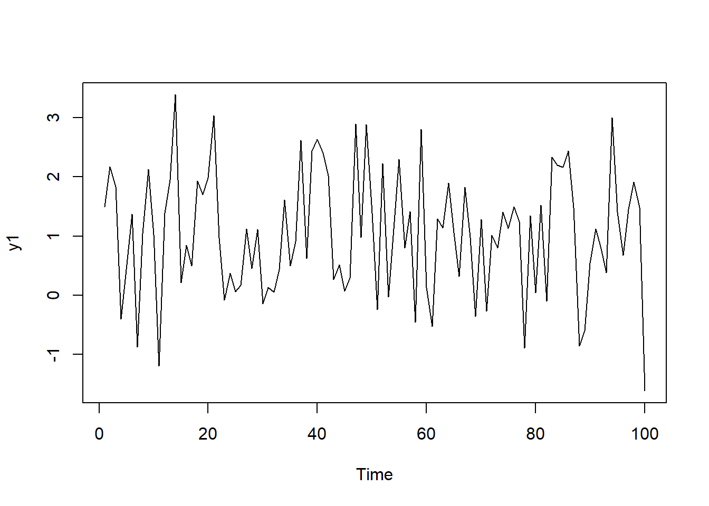{width=672}
:::

::: {.cell-output-display}
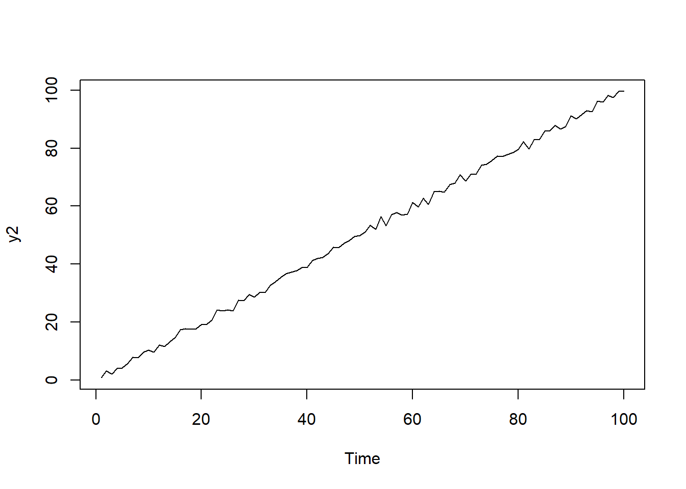{width=672}
:::

::: {.cell-output-display}
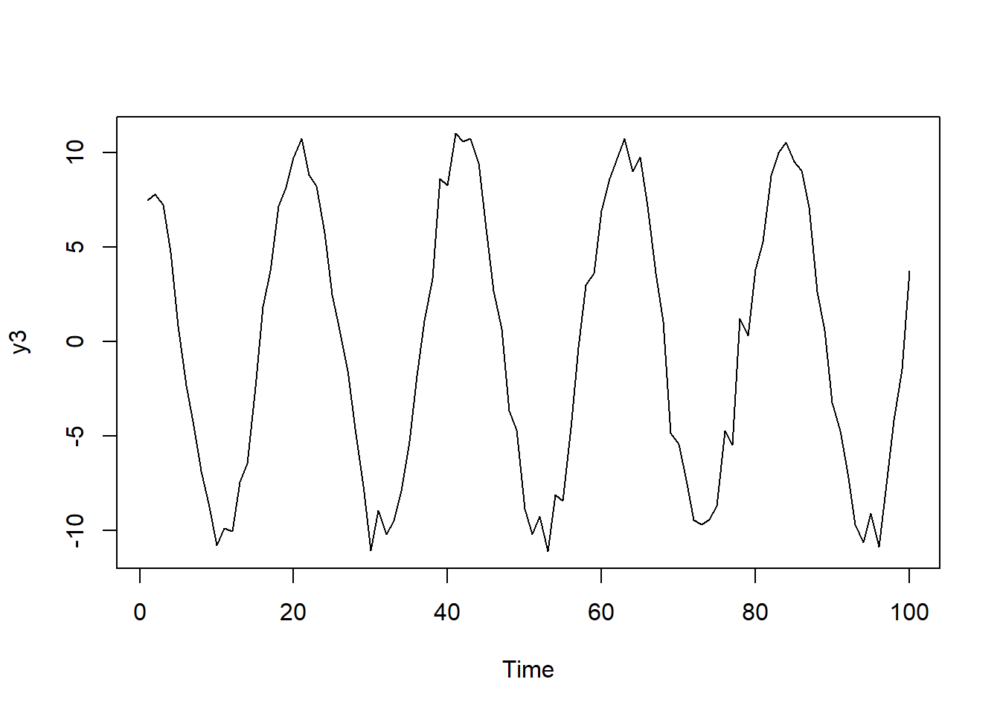{width=672}
:::

::: {.cell-output-display}
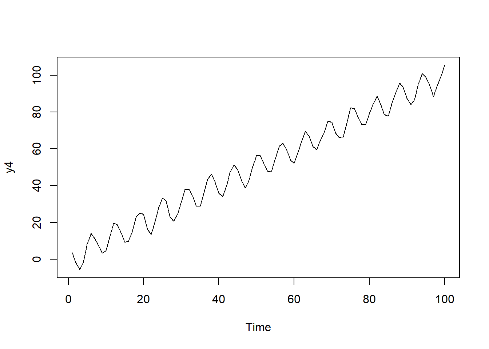{width=672}
:::
:::

## Question 2

Given the following time series.

| t   | $y_t$ |
|:----|:------|
| 1   | 1     |
| 2   | 3     |
| 3   | 5     |
| 4   | 8     |
| 5   | 12    |
| 6   | 13    |
| 7   | 16    |

a. Calculate the auto-correlation at lag 1.

b. Calculate the auto-correlation at lag 2.

c. Calculate the auto-correlation at lag 3.

## Question 3

Which of the following series is not stationary. Explain the reason. 

::: {.cell}
::: {.cell-output-display}
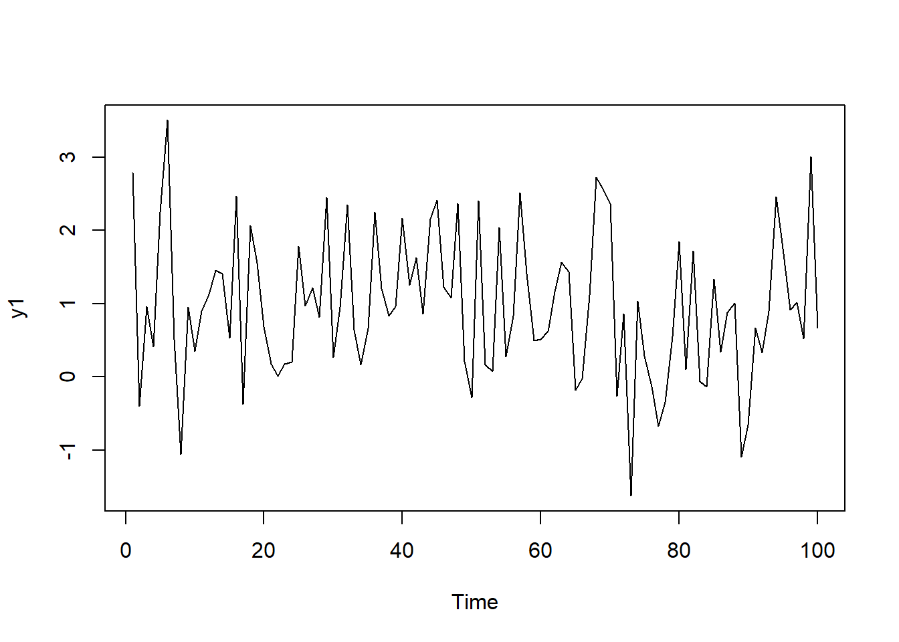{width=672}
:::

::: {.cell-output-display}
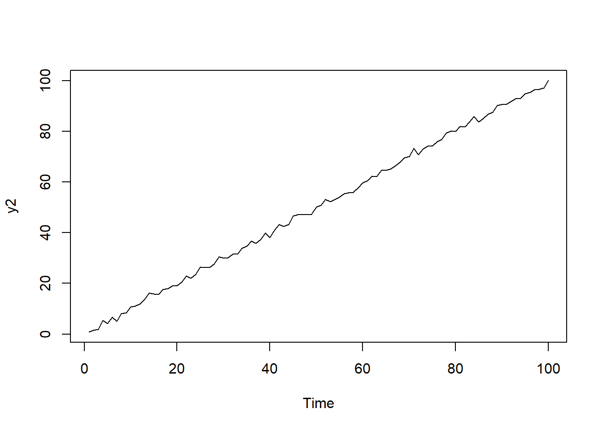{width=672}
:::

::: {.cell-output-display}
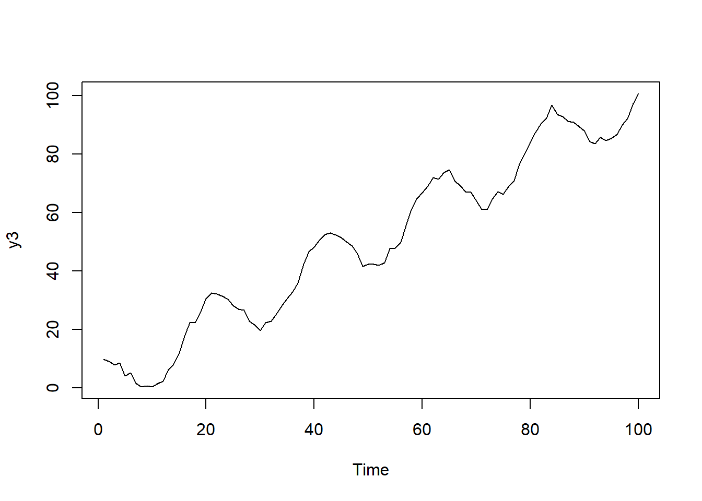{width=672}
:::

::: {.cell-output-display}
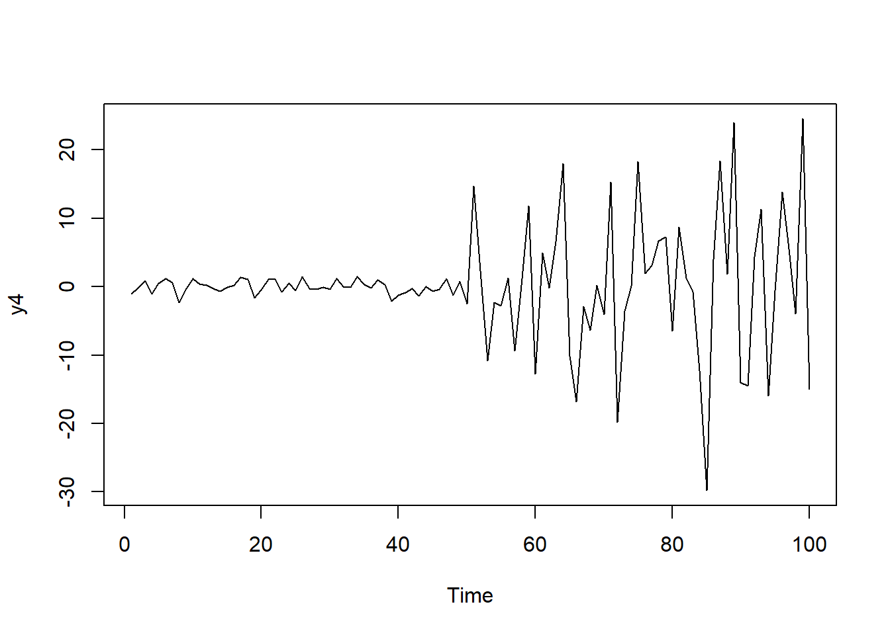{width=672}
:::
:::

## Question 4

The ACF of several time series are given below.  Based on the ACF, which time series is/are stationary and why?

::: {.cell}
::: {.cell-output-display}
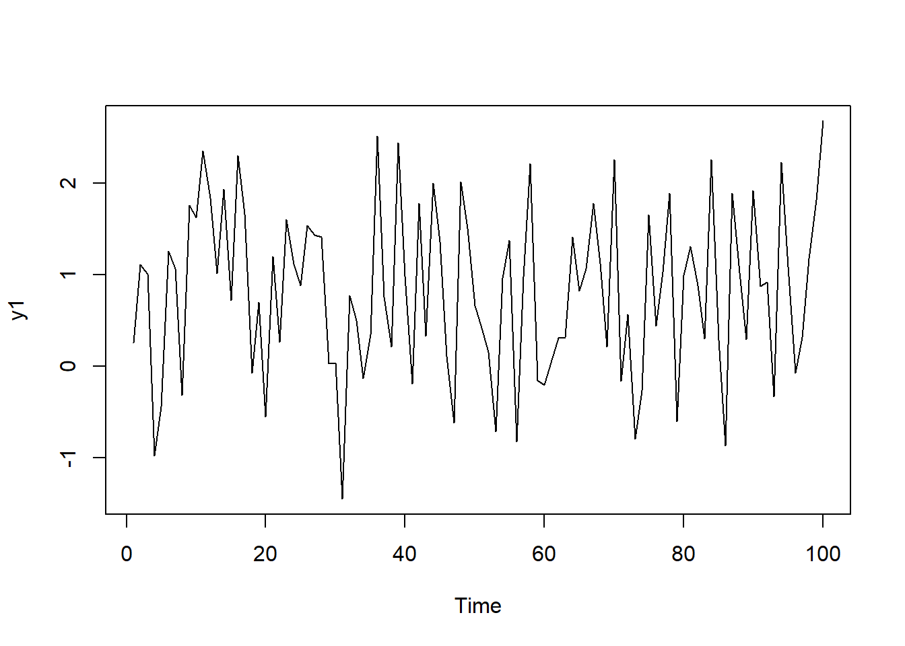{width=672}
:::

::: {.cell-output-display}
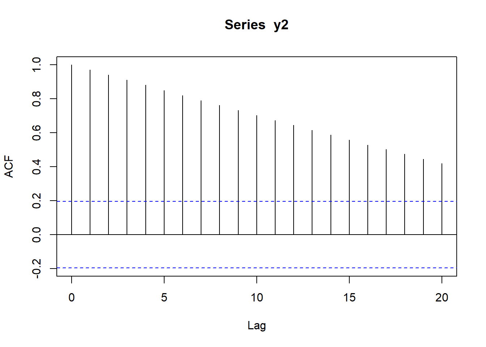{width=672}
:::

::: {.cell-output-display}
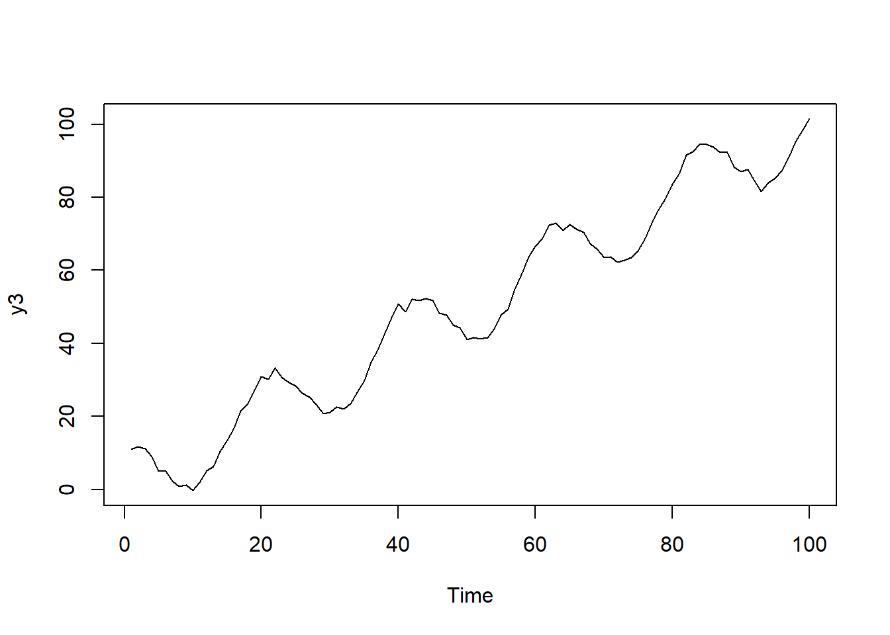{width=672}
:::

::: {.cell-output-display}
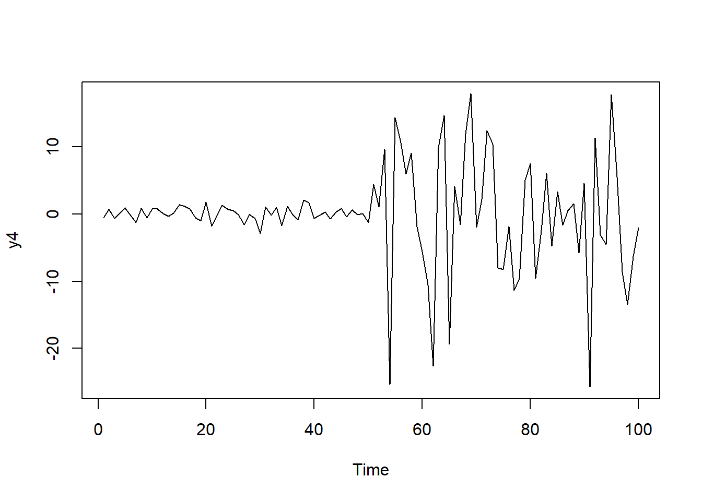{width=672}
:::

::: {.cell-output-display}
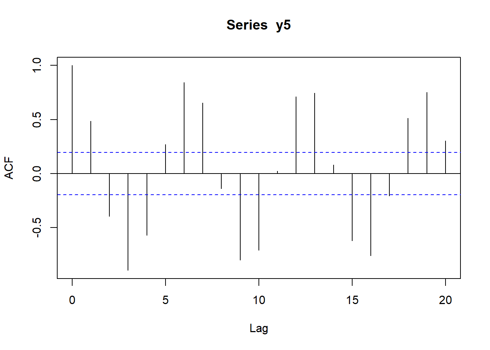{width=672}
:::
:::

------------------------------------------------------------------------
