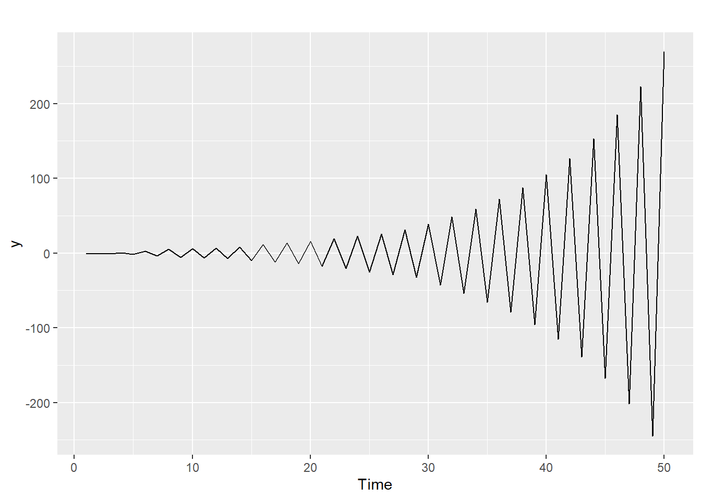
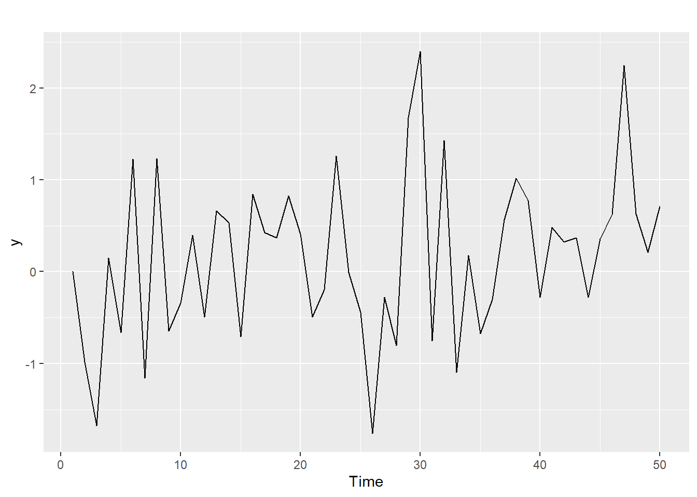
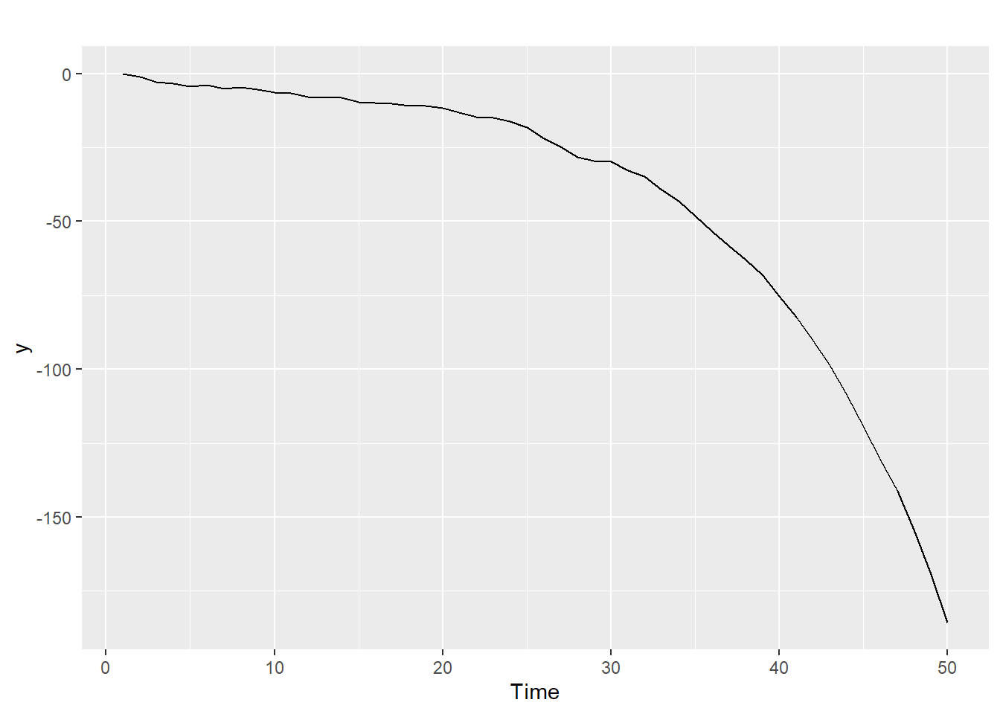
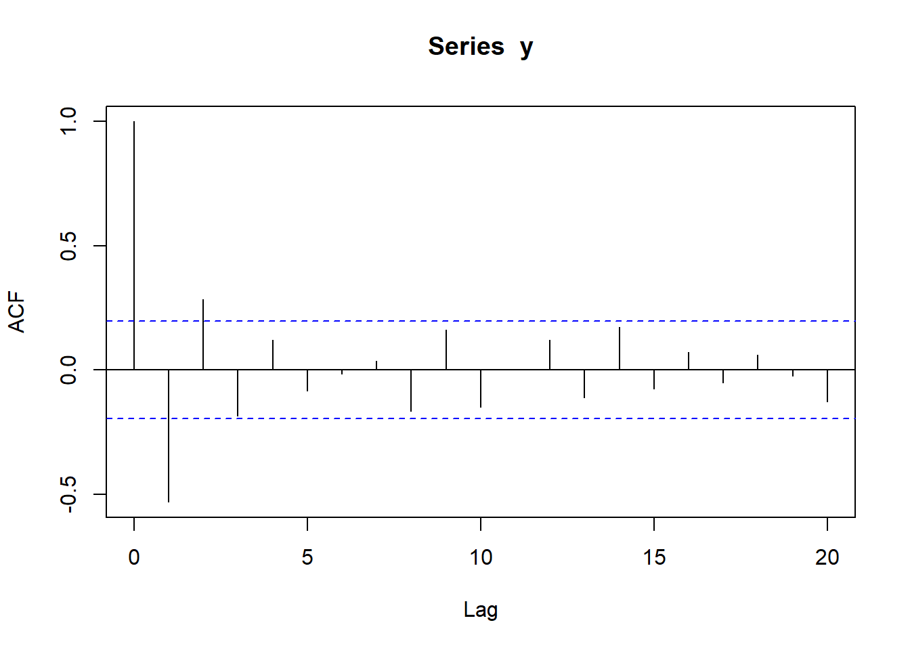
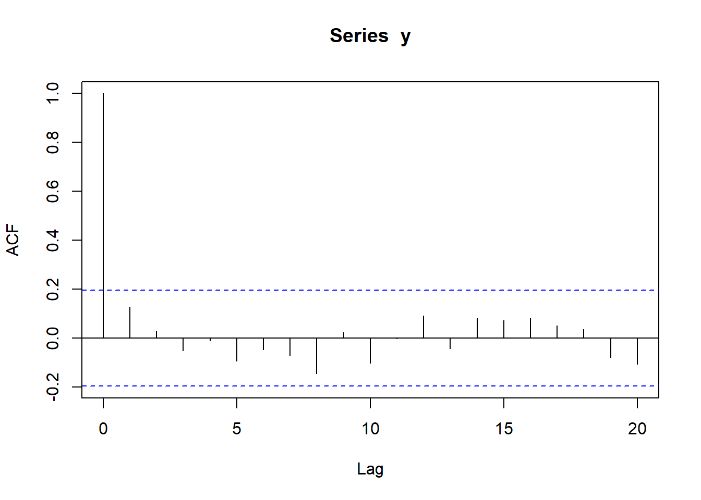
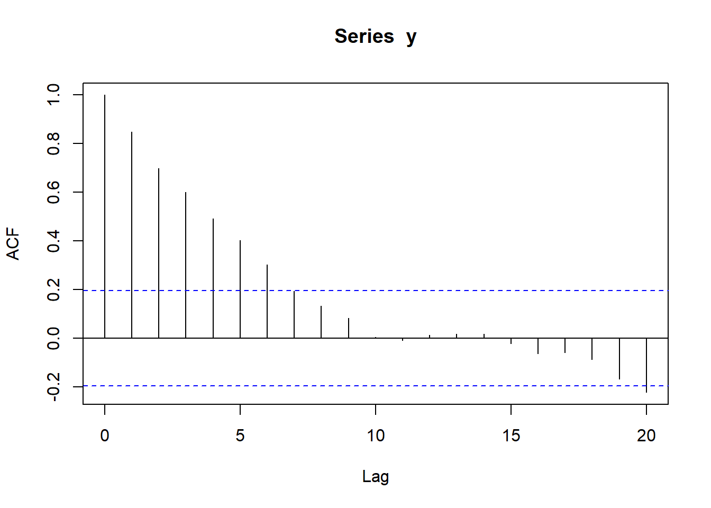
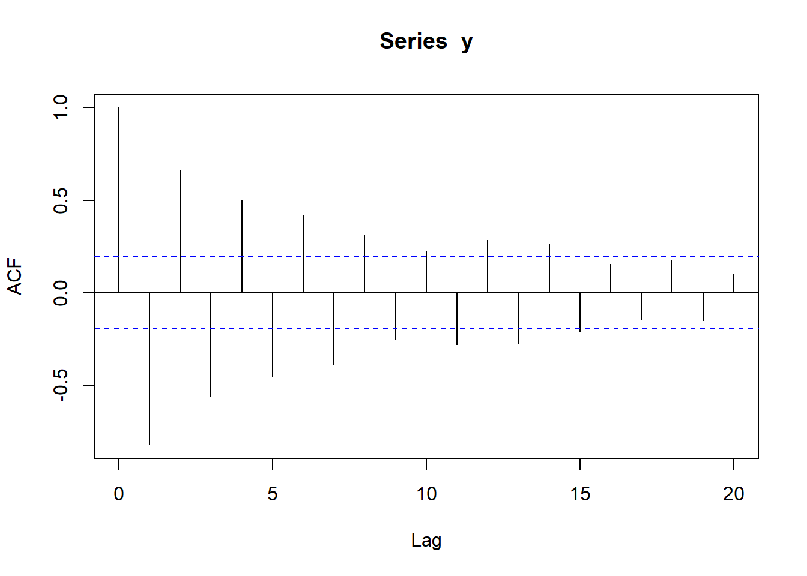
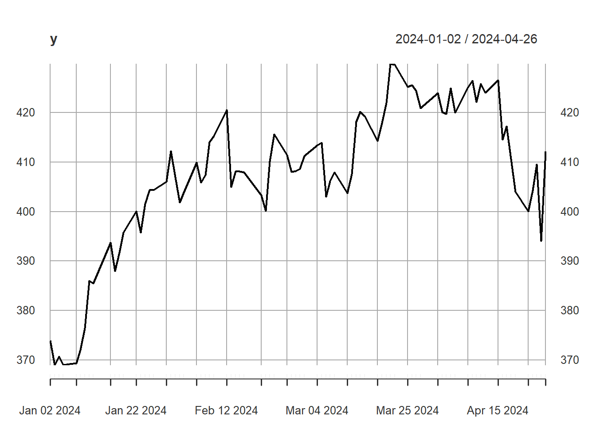
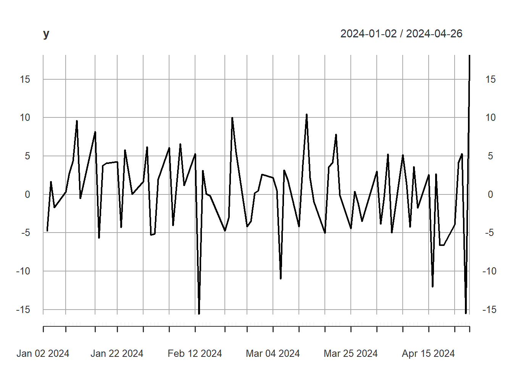
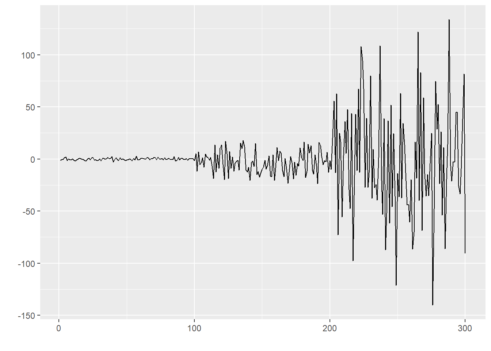

------------------------------------------------------------------------

**Instruction**: *Scan your answer into pdf/word document then submit to Canvas.*

## Problem 1

Given the following series and their plots.  Match the series with its plot.

a. $y_1 = -1.1y_{t-1} + \epsilon_t$

b. $y_2 = 1.1y_{t-1} + \epsilon_t$

c. $y_3 = -0.2y_{t-1} + \epsilon_t$

#### Plot 1

::: {.cell}
::: {.cell-output-display}
{width=672}
:::
:::

#### Plot 2

::: {.cell}
::: {.cell-output-display}
{width=672}
:::
:::

#### Plot 3

::: {.cell}
::: {.cell-output-display}
{width=672}
:::
:::

## Problem 2

Given the following four AR(1) series and their ACF.  Match the series with its ACF. 

a. $y = -.9y_{t-1} + \epsilon_t$

b. $y = .9y_{t-1} + \epsilon_t$

c. $y = .3y_{t-1} + \epsilon_t$

d. $y = -.5y_{t-1} + \epsilon_t$

#### ACF 1

::: {.cell}
::: {.cell-output-display}
{width=672}
:::
:::

#### ACF 2

::: {.cell}
::: {.cell-output-display}
{width=672}
:::
:::

#### ACF 3

::: {.cell}
::: {.cell-output-display}
{width=672}
:::
:::

#### ACF 4

::: {.cell}
::: {.cell-output-display}
{width=672}
:::
:::

## Problem 3

You are given the following six observed values of the autoregressive model of order one time series

$$y_t = \beta_0 + \beta_1 y_{t-1} + \epsilon_t, \text{ with   }  Var(\epsilon_t) = \sigma^2.$$

::: {.cell}
::: {.cell-output-display}

|  t|  y|
|--:|--:|
|  1| 12|
|  2|  5|
|  3| 10|
|  4|  4|
|  5| 11|
|  6|  3|

:::
:::

Calculate $\hat{\beta}_1$ using the conditional least squares method.

## Problem 4

You are given the following six observed values of the autoregressive model of order one time series

$$y_t = \beta_0 + \beta_1 y_{t-1} + \epsilon_t, \text{ with   }  Var(\epsilon_t) = \sigma^2.$$

::: {.cell}
::: {.cell-output-display}

|  t|  y|
|--:|--:|
|  1| 12|
|  2|  5|
|  3| 10|
|  4|  4|
|  5| 11|
|  6|  3|

:::
:::

Estimated $y_{10}$. 

## Problem 5

An autoregressive model may not be a good fit for which of the following series?

### Series 1

::: {.cell}
::: {.cell-output-display}
{width=672}
:::
:::

### Series 2

::: {.cell}
::: {.cell-output-display}
{width=672}
:::
:::

### Series 3

::: {.cell}
::: {.cell-output-display}
{width=672}
:::
:::

------------------------------------------------------------------------

