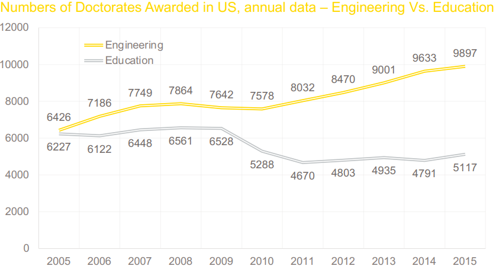
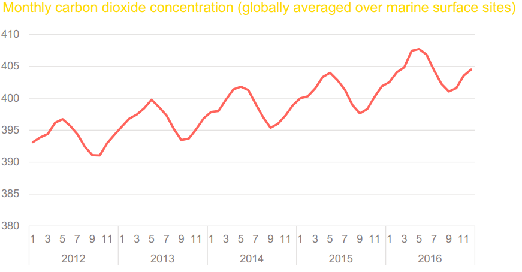
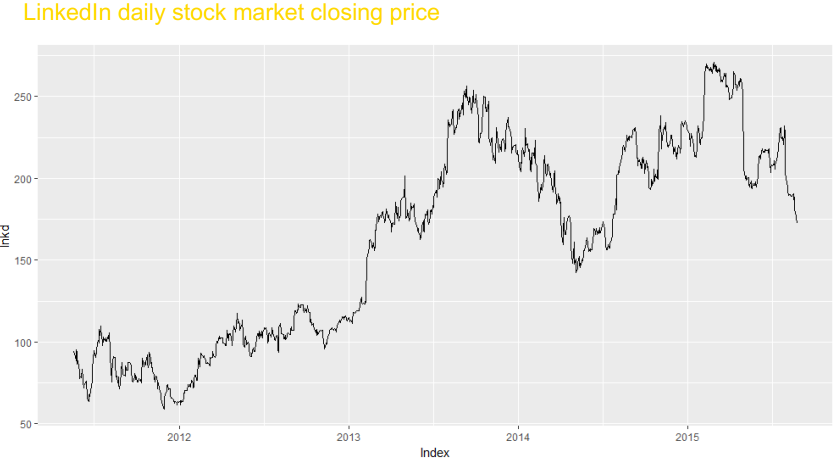
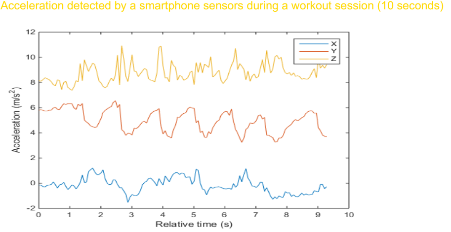

---
title: "Basic concepts in Time Series"
author: <font size="5"> Son Nguyen </font>
output:
  xaringan::moon_reader:
    css: [default, metropolis, metropolis-fonts]
    lib_dir: libs
    nature:
      highlightStyle: github
      highlightLines: true
      countIncrementalSlides: false
      slideNumberFormat: |
        <div class="progress-bar-container">
          <div class="progress-bar" style="width: calc(%current% / %total% * 100%);">
          </div>
        </div>`
        
---

<style>

.remark-slide-content {
  background-color: #FFFFFF;
  border-top: 80px solid #F9C389;
  font-size: 17px;
  font-weight: 300;
  line-height: 1.5;
  padding: 1em 2em 1em 2em
}

.inverse {
  background-color: #696767;
  border-top: 80px solid #696767;
  text-shadow: none;
  background-image: url();
	background-position: 50% 75%;
  background-size: 150px;
}

.your-turn{
  background-color: #8C7E95;
  border-top: 80px solid #F9C389;
  text-shadow: none;
  background-image: url(https://github.com/goodekat/presentations/blob/master/2019-isugg-gganimate-spooky/figures/spider.png?raw=true);
	background-position: 95% 90%;
  background-size: 75px;
}

.title-slide {
  background-color: #F9C389;
  border-top: 80px solid #F9C389;
  background-image: none;
}

.title-slide > h1  {
  color: #111111;
  font-size: 40px;
  text-shadow: none;
  font-weight: 400;
  text-align: left;
  margin-left: 15px;
  padding-top: 80px;
}
.title-slide > h2  {
  margin-top: -25px;
  padding-bottom: -20px;
  color: #111111;
  text-shadow: none;
  font-weight: 300;
  font-size: 35px;
  text-align: left;
  margin-left: 15px;
}
.title-slide > h3  {
  color: #111111;
  text-shadow: none;
  font-weight: 300;
  font-size: 25px;
  text-align: left;
  margin-left: 15px;
  margin-bottom: -30px;
}

</style>

```{css, echo=FALSE}
.left-code {
  color: #777;
  width: 48%;
  height: 92%;
  float: left;
}
.right-plot {
  width: 51%;
  float: right;
  padding-left: 1%;
}
```

```{r setup, include = FALSE}

# R markdown options
knitr::opts_chunk$set(echo = FALSE, 
                      fig.width = 10,
                      fig.height = 5,
                      fig.align = "center", 
                      message = FALSE,
                      warning = FALSE)

# Load packages
library(tidyverse)
library(forecast)
```

# Table of Contents

- Cross Sectional vs. Time Series Data

- Three Components of Time Series

- Auto-correlation and ACF

- Stationary

- White-Noise


---
class: inverse, middle, center

# Cross Sectional vs. Time Series Data

---
# Cross Sectional vs. Time Series Data

-   Cross Sectional Data: Multiple objects observed at a particular point of time

---
# Cross Sectional vs. Time Series Data

-   Cross Sectional Data: Multiple objects observed at a particular point of time

-   Examples: customers' behavioral data at today's update,companies' account balances at the end of the last year,patients' medical records at the end of the current month.


---
# Cross Sectional vs. Time Series Data

-   Time Series Data: One single object (product, country, sensor, ..) observed over multiple equally-spaced time periods

---
# Cross Sectional vs. Time Series Data

-   Time Series Data: One single object (product, country, sensor, ..) observed over multiple equally-spaced time periods

-   Examples: quarterly Italian GDP of the last 10 years, weekly supermarket sales of the previous year, yesterday's hourly temperature measurements.


---
# Cross Sectional vs. Time Series Data


---
# Examples



---
# Examples



---
# Examples



---
# Examples


---
# Examples



---
# Examples

```{r}
# define data
library(ggfortify)
library(tidyverse)
library(xts)
library(fpp2)
library(TTR)
sales=BJsales
earnings=JohnsonJohnson
nile=Nile
url="http://www.cru.uea.ac.uk/cru/data/temperature/CRUTEM3v-gl.dat"
f=read.table(url,fill=TRUE)
ny=nrow(f)/2;x=c(t(f[2*1:ny-1,2:13]))
temperature=ts(x,start=2019,frequency=12,end=c(2020,1))
autoplot(temperature)+ ggtitle("World Temperature")
```

---
# Time Series Models

We can generate time series from a time series models.  Here are some examples of time series models. 

- $y_t =  1+2t + \epsilon$, where $\epsilon \sim N(0,1)$

- $y_t =  1 + y_{t-1} + \epsilon$, where $\epsilon \sim N(0,1)$ and $y_1 = 1$

---
class: inverse, center, middle 

# Three Components of Time Series

---
# Time Series Patterns

A time series may consist of 

- trend, 

- seasonality and 

- cycles

---
# Trend

- A trend is a long-term increase or decrease in the data. 

- Trend does not have to be linear. 

- Sometimes we will refer to a trend as changing direction, when it might go from an increasing trend to a decreasing trend. 

---
# Examples


- There is a downward trend. The US treasury bill contracts show results from the Chicago market for 100 consecutive trading days in 1981. 

---
# Examples


- There is no apparent trend in the data over this period

---
# Cycle and Seasonal

- cycle: repeated events over time that are not equally spaced

- seasonal: repeated events over time that are equally spaced

---
# Examples


- The monthly housing sales show strong seasonality within each year, as well as some strong cyclic behavior with a period of about 6-10 years

---
# Examples


The Australian quarterly electricity production shows a strong increasing trend, with strong seasonality. There is no evidence of any cyclic behavior here

---
# Examples


- No trend, seasonality or cyclic behaviour. There are random fluctuations which do not appear to be very predictable, and no strong patterns that would help with developing a forecasting model.

---
class: inverse, center, middle

# Correlogram and ACF

---
# Correlation and Auto-correlation

- The correlation between two variables measure how strong the linear relation between them. 

- The correlation between a time series $y_t$ and the yesterday's version of itself $y_{t-1}$ is call Auto-correlation at lag 1. 

- Auto-correlation lag with lag $k$ is the the correlation between the time series $y_t$ and $y_{t-k}$

- Auto-correlation at lag $k$ is


---
# Correlation and Auto-correlation

- Auto-correlation lag with lag k is the the correlation between the time series $y_t$ and $y_{t-k}$

- Auto-correlation lag with lag 0 is always 1

- The Correlogram is the plot of the Auto-correlations for values of lag k = 0, 1, 2,...

- The Auto-correlation function (ACF) is the function where the input is a lag and the output is the Auto-correlation of the lag. 

---
# Problem 1

| t   | $y_t$ |
|:----|:------|
| 1   | 1     |
| 2   | 3     |
| 3   | 5     |
| 4   | 8     |
| 5   | 12    |
| 6   | 13    |
| 7   | 16    |

Calculate the auto-correlation at lag 1 ( $r_1$ ) and at lag 2 ( $r_2$ )

---
# Solution

- $\bar{y} = \frac{1+3+5+8+12}{5}=5.8$

- Form the table

| t   | $y_t$ | $y_t -  \bar{y}$ | $y_t -  \bar{y}$ |
|:----|:------|:------|:------|
| 1   | 1     | -4.8      |  -4.8       |
| 2   | 3     | -2.8     | -2.8       |
| 3   | 5     | -0.8     |-0.8        |
| 4   | 8     | 2.2     |   2.2     |
| 5   | 12    | 6.2     |  6.2      |

- Calculate the denominator of $r_1$: $$\sum(y_t-\bar{y})^2 = (-4.8)^2+(-2.8)^2+(-.8)^2+2.2^2+6.2^2 = 74.8$$

- Calculate the numerator of $r_1$: $$(-4.8)*(-2.8) + (-2.8)*(-0.8) + (-0.8)*(2.2)+(2.2)*(6.2) = 27.56$$

- $r_1 = 27.56/74.8 = 0.368$

---
# Solution

- $\bar{y} = \frac{1+3+5+8+12}{5}=5.8$

- Form the table

| t   | $y_t$ | $y_t -  \bar{y}$ | $y_t -  \bar{y}$ |
|:----|:------|:------|:------|
| 1   | 1     | -4.8      |  -4.8       |
| 2   | 3     | -2.8     | -2.8       |
| 3   | 5     | -0.8     |-0.8        |
| 4   | 8     | 2.2     |   2.2     |
| 5   | 12    | 6.2     |  6.2      |

- Calculate the denominator of $r_2$ (the same as $r_1$ or any $r_k$) : $$\sum(y_t-\bar{y})^2 = (-4.8)^2+(-2.8)^2+(-.8)^2+2.2^2+6.2^2 = 74.8$$

- Calculate the numerator of $r_2$: $$(-4.8)*(-0.8) + (-2.8)*(2.2) + (-0.8)*(6.2) = -7.28$$

- $r_2 = -7.28/74.8 = -0.0973$

---
# Correlogram a time series with trend

- Usually a trend in the data will show in the correlogram as a slow decay in the Auto-correlation

```{r}
y = ts(c(1:100))
acf(y)
```

---
# The Correlogram - Example

```{r}
y = ts(cos(c(1:100))+rnorm(100))
acf(y)
```

---
# ACF of a time series with seasonality

```{r}
set.seed(30)
y = cos(1:100)
y <- ts(y)
acf(y)
```


---
class: inverse, center, middle
# Stationary

---
# Stationary

- A common assumption in many time series techniques is that the series are stationary.

- What is stationary?

- Intuitively, stationarity means that the statistical properties of a series do not change over time.

---
# Definition

-   A time series $y_t$ is stationary if

    -   $E(y_t) = constant$

    -   $Cov(y_t, y_s)$ only depends on the time lag $|t-s|$

-   If $y_t$ is stationary then $Var(y_t) = Constant$


---
# Series with Trend/Seasonality

- Series with trend or seasonality are not stationary


---
# Example

```{r}
set.seed(30)
n = 100
e <- ts(rnorm(n, sd = 10))
t = c(1:n)
y = 2*t+3+e
library(ggfortify)
autoplot(y) + ggtitle("")
```

---
# Example

```{r}
set.seed(30)
n = 100
e <- ts(rnorm(n, sd = 10))
t = c(1:n)
y = 2*t+3+e
library(ggfortify)
autoplot(y) + ggtitle("Non-stationary due to non-constant expected value")
```

- Time series with trend (hence the mean is not a constant) is not stationary. 


---
# Example


```{r}
set.seed(10)
y <- arima.sim(list(order=c(0,1,0)), n=1000)
library(ggfortify)
autoplot(y) + ggtitle("A Non-Stationary Time Series")
```

- This is a plot of a Random Walk series. The series is not stationary because the expected value (the mean) is changing over time, i.e. the series has trend. 

---
# Example

```{r}
set.seed(30)
n = 200
e <- ts(rnorm(n, sd = .1))
t = cos(.2*c(1:n))
y = t+e
library(ggfortify)
autoplot(y) + ggtitle("Non-stationary due to seasonality")
```

- Time series with seasonality is not stationary. 


---
# Example

```{r}
set.seed(30)
n = 100
e1 <- rnorm(n, sd = 1)
e2 <- rnorm(n, sd = 10)
e3 <- rnorm(n, sd = 50)
y = c(e1,e2,e3)
library(ggfortify)
autoplot(ts(y)) + ggtitle("")
```

---
# Example

```{r}
set.seed(30)
n = 100
e1 <- rnorm(n, sd = 1)
e2 <- rnorm(n, sd = 10)
e3 <- rnorm(n, sd = 50)
y = ts(c(e1,e2,e3))
library(ggfortify)
autoplot(y) + ggtitle("Non-stationary due to non-constant variance")
```


---
# Example

```{r}
set.seed(10)
y <- ts(rnorm(200))
library(ggfortify)
autoplot(y) + ggtitle("A Stationary Time Series")
```

- This is a stationary series where both the mean and variance stay constant. 


---
# Stationarity Analysis

We can inverstigate the stationarity of a time series using the following tools. 

- Its ACF

- The Ljung-Box test for independence

- The Augmented Dickey–Fuller (ADF) t-statistic test for unit root

- The Kwiatkowski-Phillips-Schmidt-Shin (KPSS) for level or trend stationarity

---
# ACF of stationary series

- ACF of stationary usually quickly goes to zeros.

- For example: below is the ACF of a stationary series

```{r}
set.seed(2024)
y = ts(rnorm(100))
acf(y)
```
---
# ACF of stationary series

- ACF of stationary usually quickly goes to zeros. Going zeroes here means the values is within the blue strip.  

- For example: below is the ACF of a stationary series

```{r}
set.seed(2024)
y = arima.sim(list(order=c(1,0,0), ar=c(.4)), n=100)
acf(y)
```

---
# ACF of trend series

- ACF of time series with trend (hence, not stationary) usually decreases slowly. 

- For example: below is the ACF of a linear trend (hence, not stationary) series. We observe that the ACF does not die out to zero (does not converge into the blue strip).

```{r}
set.seed(2024)
y = ts(c(100:1)+ rnorm(100))
acf(y)
```
---
# ACF of seasonal series

- Below is the ACF of a time series with seasonality (hence, not stationary). We observe that the ACF does not die out to zero (does not converge into the blue strip).

```{r}
set.seed(2024)
y = ts(5*cos(c(1:100))+ rnorm(100))
acf(y)
```

---
# Time Series Transformation

- A non-stationary time series $y_t$ can be transformed to stationary series $z_t$ for modeling.  There are two basic transformations.  

- Differencing: $z_t = y_{t}-y_{t-1}$. 

- Log transformation: $z_t = \log(y_t)$.  This transformation can stabilize variance by reducing the impact of extreme values.

---
class: inverse, center, middle

# White Noise

---
# Basic Time Series

- There are some basic time series or models such as

- White Noise Series/Models

- Random Walk Series/Models

- Simple Autoregressive Models

---
# White-Noise

-   $y_t$ is a white-noise process (series) if $y_1$, $y_2$,..., $y_t$ are independent identical distributed (iid) zero mean random variables from a certain distribution (usually normal)

---
# Example

```{r}
set.seed(30)
y <- ts(rnorm(100))
library(ggfortify)
autoplot(y) + ggtitle("White noise of Standard Normal Distribution")
```
---
# Example

```{r}
set.seed(30)

y = sample(c(-1, 1), 100, replace = TRUE)

y <- ts(y)
library(ggfortify)
autoplot(y) + ggtitle("White noise of Tossing a Coin")
```

---
# Stationary of a white noise

- White-Noise is stationary

```{r}
set.seed(10)
y <- ts(rnorm(200))
library(ggfortify)
autoplot(y) + ggtitle("A Stationary Time Series")
```

---
# Correlogram a white noise

- Correlogram of a white noise

```{r}
# create a white-noise time series
y = ts(rnorm(100))

# plot its ACF or correlogram 
acf(y)
```

---
# Correlogram a white noise

```{r}
set.seed(30)
y = sample(c(-1, 1), 100, replace = TRUE)
y <- ts(y)
acf(y)
```