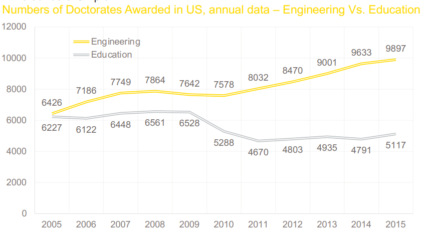
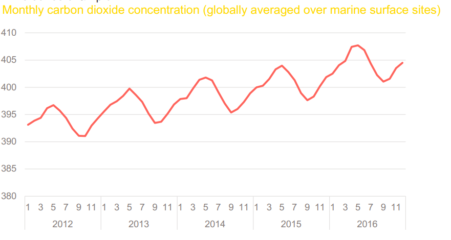
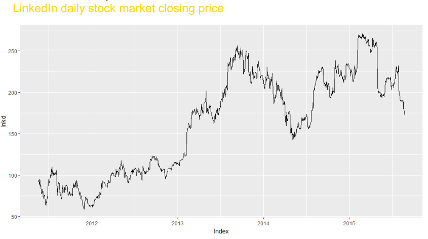
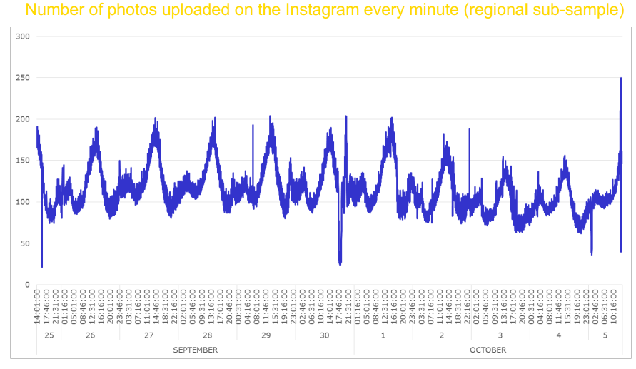
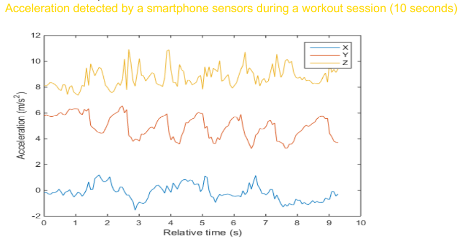
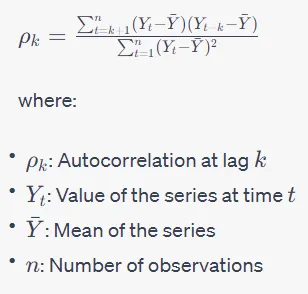
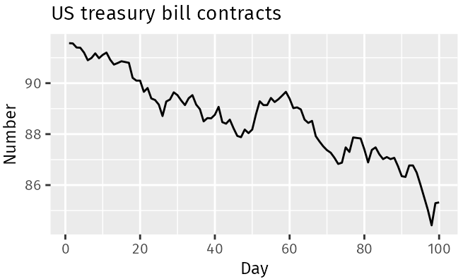
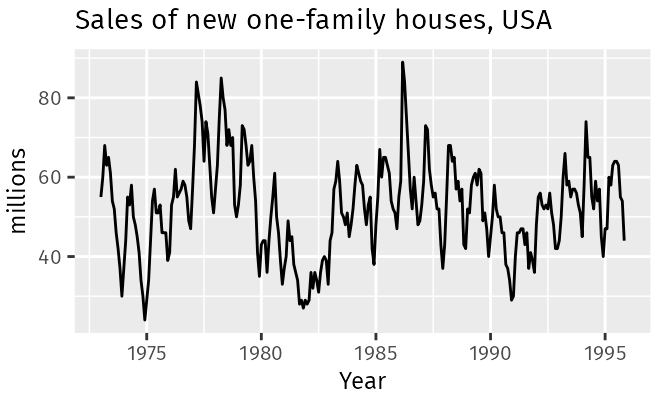
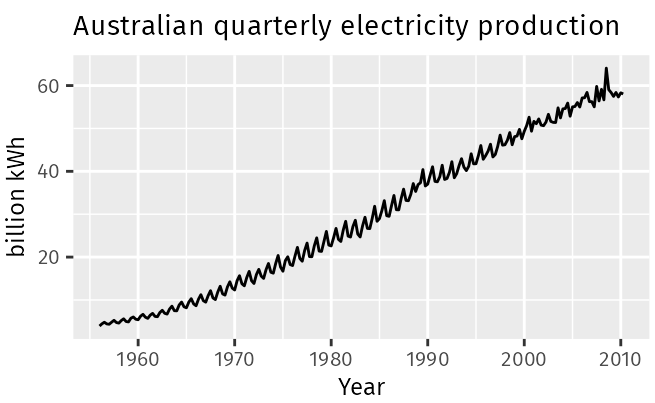
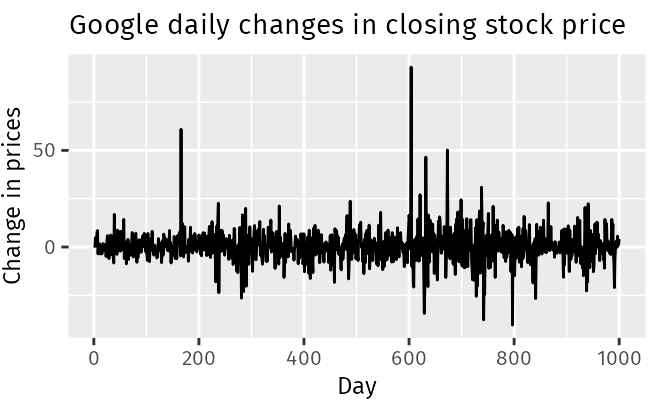

---
title: "Exponential Smoothing Models"
author: <font size="5"> Son Nguyen </font>
output:
  xaringan::moon_reader:
    css: [default, metropolis, metropolis-fonts]
    lib_dir: libs
    nature:
      highlightStyle: github
      highlightLines: true
      countIncrementalSlides: false
      slideNumberFormat: |
        <div class="progress-bar-container">
          <div class="progress-bar" style="width: calc(%current% / %total% * 100%);">
          </div>
        </div>`
---

<style>

.remark-slide-content {
  background-color: #FFFFFF;
  border-top: 80px solid #F9C389;
  font-size: 17px;
  font-weight: 300;
  line-height: 1.5;
  padding: 1em 2em 1em 2em
}

.inverse {
  background-color: #696767;
  border-top: 80px solid #696767;
  text-shadow: none;
  background-image: url(https://github.com/goodekat/presentations/blob/master/2019-isugg-gganimate-spooky/figures/spider.png?raw=true);
	background-position: 50% 75%;
  background-size: 150px;
}

.your-turn{
  background-color: #8C7E95;
  border-top: 80px solid #F9C389;
  text-shadow: none;
  background-image: url(https://github.com/goodekat/presentations/blob/master/2019-isugg-gganimate-spooky/figures/spider.png?raw=true);
	background-position: 95% 90%;
  background-size: 75px;
}

.title-slide {
  background-color: #F9C389;
  border-top: 80px solid #F9C389;
  background-image: none;
}

.title-slide > h1  {
  color: #111111;
  font-size: 40px;
  text-shadow: none;
  font-weight: 400;
  text-align: left;
  margin-left: 15px;
  padding-top: 80px;
}
.title-slide > h2  {
  margin-top: -25px;
  padding-bottom: -20px;
  color: #111111;
  text-shadow: none;
  font-weight: 300;
  font-size: 35px;
  text-align: left;
  margin-left: 15px;
}
.title-slide > h3  {
  color: #111111;
  text-shadow: none;
  font-weight: 300;
  font-size: 25px;
  text-align: left;
  margin-left: 15px;
  margin-bottom: -30px;
}

</style>

```{css, echo=FALSE}
.left-code {
  color: #777;
  width: 48%;
  height: 92%;
  float: left;
}
.right-plot {
  width: 51%;
  float: right;
  padding-left: 1%;
}
```

```{r setup, include = FALSE}

# R markdown options
knitr::opts_chunk$set(echo = FALSE, 
                      fig.width = 10,
                      fig.height = 5,
                      fig.align = "center", 
                      message = FALSE,
                      warning = FALSE)

# Load packages
library(tidyverse)
library(forecast)
```


# Cross Sectional vs. Time Series Data

-   Cross Sectional Data: Multiple objects observed at a particular point of time

---
# Cross Sectional vs. Time Series Data

-   Cross Sectional Data: Multiple objects observed at a particular point of time

-   Examples: customers' behavioral data at today's update,companies' account balances at the end of the last year,patients' medical records at the end of the current month.

---
# Cross Sectional vs. Time Series Data

-   Time Series Data: One single object (product, country, sensor, ..) observed over multiple equally-spaced time periods

---
# Cross Sectional vs. Time Series Data

-   Time Series Data: One single object (product, country, sensor, ..) observed over multiple equally-spaced time periods

-   Examples: quarterly Italian GDP of the last 10 years, weekly supermarket sales of the previous year, yesterday's hourly temperature measurements.

---
# Examples



---
# Examples



---
# Examples



---
# Examples



---
# Examples



---
# Examples

```{r}
# define data
library(ggfortify)
library(tidyverse)
library(xts)
library(fpp2)
library(TTR)
sales=BJsales
earnings=JohnsonJohnson
nile=Nile
url="http://www.cru.uea.ac.uk/cru/data/temperature/CRUTEM3v-gl.dat"
f=read.table(url,fill=TRUE)
ny=nrow(f)/2;x=c(t(f[2*1:ny-1,2:13]))
temperature=ts(x,start=2019,frequency=12,end=c(2020,1))
autoplot(temperature)+ ggtitle("World Temperature")
```

---
# What to do with time series?

-   Understanding of specific series features or pattern

-   Forecasting


---
# White Noise

---
# Stationary

-   A time series $y_t$ is stationary if

    -   $E(y_t) = constant$

    -   $Cov(y_t, y_s)$ only depends on the time lag $|t-s|$

-   If $y_t$ is stationary then $Var(y_t) = Constant$

---
# Example

```{r}
set.seed(30)
n = 100
e <- ts(rnorm(n, sd = 10))
t = c(1:n)
y = 2*t+3+e
library(ggfortify)
autoplot(y) + ggtitle("")
```

---
# Example

```{r}
set.seed(30)
n = 100
e <- ts(rnorm(n, sd = 10))
t = c(1:n)
y = 2*t+3+e
library(ggfortify)
autoplot(y) + ggtitle("Non-stationary due to non-constant expected value")
```

---
# Example

```{r}
set.seed(30)
n = 100
e1 <- rnorm(n, sd = 1)
e2 <- rnorm(n, sd = 10)
e3 <- rnorm(n, sd = 50)
y = c(e1,e2,e3)
library(ggfortify)
autoplot(ts(y)) + ggtitle("")
```

---
# Example

```{r}
set.seed(30)
n = 100
e1 <- rnorm(n, sd = 1)
e2 <- rnorm(n, sd = 10)
e3 <- rnorm(n, sd = 50)
y = ts(c(e1,e2,e3))
library(ggfortify)
autoplot(y) + ggtitle("Non-stationary due to non-constant variance")
```

---
# Example

```{r}
set.seed(10)
y <- ts(rnorm(200))
library(ggfortify)
autoplot(y) + ggtitle("")
```

---
# Example

- White Noise is stationary

```{r}
set.seed(10)
y <- ts(rnorm(200))
library(ggfortify)
autoplot(y) + ggtitle("A Stationary Time Series")
```


---
# Example

- Random Walk is not stationary


```{r}
set.seed(10)
y <- arima.sim(list(order=c(0,1,0)), n=1000)
library(ggfortify)
autoplot(y) + ggtitle("A Non-Stationary Time Series")
```

---

- Series with trend or seasonality are not stationary


# White Noise

-   $y_t$ is a white-noise process (series) if $y_1$, $y_2$,..., $y_t$ are independent identical distributed (iid) zero mean random variables from a certain distribution (usually normal)

---
# Example

```{r}
set.seed(30)
y <- ts(rnorm(100))
library(ggfortify)
autoplot(y) + ggtitle("White noise of Standard Normal Distribution")
```
---
# Example

```{r}
set.seed(30)

y = sample(c(-1, 1), 100, replace = TRUE)

y <- ts(y)
library(ggfortify)
autoplot(y) + ggtitle("White noise of Tossing a Coin")
```
---
# Correlogram

- Autocorrelation lag with lag k is the the correlation between the time series $y_t$ and $y_{t-k}$



- Autocorrelation lag with lag 0 is always 1

- The Correlogram is the plot of the autocorrelations for values of lag k = 0, 1, 2,...

---
# Correlogram a white noise

- Correlogram of a white noise

```{r}
# create a white-noise time series
y = ts(rnorm(100))

# plot its ACF or correlogram 
acf(y)
```

---
# Correlogram a white noise

```{r}
set.seed(30)
y = sample(c(-1, 1), 100, replace = TRUE)

y <- ts(y)

acf(y)

```

---
# Correlogram a time series with trend

- Usually a trend in the data will show in the correlogram as a slow decay in the autocorrelation

```{r}
y = ts(c(1:100))
acf(y)
```

---
# The Correlogram - Example

```{r}
y = ts(cos(c(1:100))+rnorm(100))
acf(y)
```

---
# ACF of a time series with seasonality

```{r}
set.seed(30)
y = cos(1:100)
y <- ts(y)
acf(y)
```


---
# Three Components of Time Series


---
# Time Series Patterns

A time series may consist of 

- trend, 

- seasonality and 

- cycles

---
# Trend

- A trend is a long-term increase or decrease in the data. 

- Trend does not have to be linear. 

- Sometimes we will refer to a trend as “changing direction”, when it might go from an increasing trend to a decreasing trend. 

---
# Examples



- The US treasury bill contracts show results from the Chicago market for 100 consecutive trading days in 1981. There is a downward trend

---
# Examples



- There is no apparent trend in the data over this period

# Cycle and Seasonal

- cycle: repeated events over time that are not equally spaced

- seasonal: repeated events over time that are equally spaced


---
# Examples


- The monthly housing sales show strong seasonality within each year, as well as some strong cyclic behaviour with a period of about 6–10 years


---
# Examples



The Australian quarterly electricity production shows a strong increasing trend, with strong seasonality. There is no evidence of any cyclic behavior here

---
# Examples



- No trend, seasonality or cyclic behaviour. There are random fluctuations which do not appear to be very predictable, and no strong patterns that would help with developing a forecasting model.


---
# Time series decomposition

- When we decompose a time series into components, we usually combine the trend and cycle into a single trend-cycle component (sometimes called the trend for simplicity). 

- Three components: a trend-cycle component, a seasonal component, and a remainder component (containing anything else in the time series).

