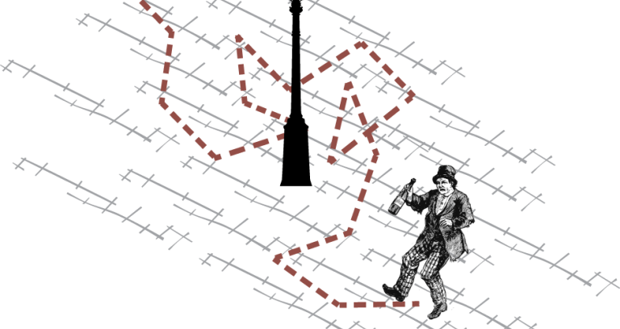

---
title: " Random Walk Models"
author: <font size="5"> Son Nguyen </font>
output:
  xaringan::moon_reader:
    css: [default, metropolis, metropolis-fonts]
    lib_dir: libs
    nature:
      highlightStyle: github
      highlightLines: true
      countIncrementalSlides: false
      slideNumberFormat: |
        <div class="progress-bar-container">
          <div class="progress-bar" style="width: calc(%current% / %total% * 100%);">
          </div>
        </div>`
---

<style>

.remark-slide-content {
  background-color: #FFFFFF;
  border-top: 80px solid #F9C389;
  font-size: 17px;
  font-weight: 300;
  line-height: 1.5;
  padding: 1em 2em 1em 2em
}

.inverse {
  background-color: #696767;
  border-top: 80px solid #696767;
  text-shadow: none;
  background-image: url(https://github.com/goodekat/presentations/blob/master/2019-isugg-gganimate-spooky/figures/spider.png?raw=true);
	background-position: 50% 75%;
  background-size: 150px;
}

.your-turn{
  background-color: #8C7E95;
  border-top: 80px solid #F9C389;
  text-shadow: none;
  background-image: url(https://github.com/goodekat/presentations/blob/master/2019-isugg-gganimate-spooky/figures/spider.png?raw=true);
	background-position: 95% 90%;
  background-size: 75px;
}

.title-slide {
  background-color: #F9C389;
  border-top: 80px solid #F9C389;
  background-image: none;
}

.title-slide > h1  {
  color: #111111;
  font-size: 40px;
  text-shadow: none;
  font-weight: 400;
  text-align: left;
  margin-left: 15px;
  padding-top: 80px;
}
.title-slide > h2  {
  margin-top: -25px;
  padding-bottom: -20px;
  color: #111111;
  text-shadow: none;
  font-weight: 300;
  font-size: 35px;
  text-align: left;
  margin-left: 15px;
}
.title-slide > h3  {
  color: #111111;
  text-shadow: none;
  font-weight: 300;
  font-size: 25px;
  text-align: left;
  margin-left: 15px;
  margin-bottom: -30px;
}

</style>

```{css, echo=FALSE}
.left-code {
  color: #777;
  width: 48%;
  height: 92%;
  float: left;
}
.right-plot {
  width: 51%;
  float: right;
  padding-left: 1%;
}
```

```{r setup, include = FALSE}

# R markdown options
knitr::opts_chunk$set(echo = TRUE, 
                      fig.width = 10,
                      fig.height = 5,
                      fig.align = "center", 
                      message = FALSE,
                      warning = FALSE)

# Load packages
library(tidyverse)
library(forecast)
```


# Random Walk

-   A time series $y_t$ is called a random walk if

    $$y_{t} =  y_{t-1} +  \epsilon_t,$$

    where $\epsilon_t$ is a white-noise with mean zeros

-   For the equation we also have $y_{t-1} = y_{t-2}+\epsilon_{t-1}$ and $y_{t-2} = y_{t-3}+\epsilon_{t-2}$ so on. 

- Thus, a random walk can be written as

\begin{align}
y_t &= y_{t-1}+\epsilon_t \\
    &= (y_{t-2}+ \epsilon_{t-1}) + \epsilon_t \\
    &=  ... \\
    &= y_0 + \epsilon_1 + \epsilon_2 +...+\epsilon_t 
\end{align}

---
class: inverse, center, middle

# Simulating Random Walk

---
# Simulating Random Walk

To simulate a random walk we would need two things

(1) The initial value $y_0$

(2) The white noise series $\epsilon_t$ ( $\epsilon_1$, $\epsilon_2$, ... , $\epsilon_t$)


---
# Example

In this example, we will simulate/generate a random walk with

- $y_0 = 10$

- $\epsilon_t$ following a `coin tossing` distribution where $\epsilon_t = 1$ if the coin lands Head and $\epsilon_t = -1$ if the coin lands tail. 

- We assume that the coin is fair so that $E(\epsilon_t = 0)$ making it a white noise distribution. 

---
# Example

- We first generate the $\epsilon_t$ using the `sample` function as follows.  

```{r}
n  = 100  
e_t = sample(c(-1, 1), n, replace =  TRUE)
e_t
```

---
# Example

- We then create $y_t = y_0 + \epsilon_1 + \epsilon_2 +...+\epsilon_t$ using the `cumsum` function. 

```{r}
y0 = 10

y = cumsum(c(y0,e_t))
plot(ts(y))
```


---
# Example

- Notice that since this is a random process every time we run the codes, we will obtain a different random walk. 

```{r}
n  = 100  
e_t = sample(c(-1, 1), n, replace =  TRUE)

y0 = 10
y = cumsum(c(y0,e_t))
plot(ts(y))
```


---
# Example

- Rerun the same codes. Notice a different random walk. 

```{r}
n  = 100  
e_t = sample(c(-1, 1), n, replace =  TRUE)

y0 = 10
y = cumsum(c(y0,e_t))
plot(ts(y))
```

---
# Example

- To fix the randomness, i.e., reproduce the series the next time we run the code, we could use the function `set.seed` before creating the the randomness ($\epsilon_t$)


```{r}
n  = 100  
set.seed(2024)
e_t = sample(c(-1, 1), n, replace =  TRUE)

y0 = 10
y = cumsum(c(y0,e_t))
plot(ts(y))
```


---
# Example

- Let run these same codes. Notice the random walk remains the same.  


```{r}
n  = 100  
set.seed(2024)
e_t = sample(c(-1, 1), n, replace =  TRUE)

y0 = 10
y = cumsum(c(y0,e_t))
plot(ts(y))
```


---
# Example

- Similarly, we can generate a random walk where the white noise following `the rolling a dice experiment`. 

- To make sure that the mean of the white-noise is zero, we will set the face values of the die are -3, -2, -1, 1, 2, 3 instead of 1, 2, 3, 4, 5, 6 as a regular die. 


```{r}
n  = 100  
set.seed(2024)
e_t = sample(c(-3, -2, -1,  1 , 2, 3), n, replace =  TRUE)

y0 = 10
y = cumsum(c(y0,e_t))
plot(ts(y))
```


---
# Example

- In the below codes, we create a random walk with the white noise $\epsilon$ follows a standard normal distribution (Gaussian distribution). 

- We use the function `rnorm` to generate the Gaussian white noise. 

```{r}
set.seed(2024)
n = 100
e_t <- rnorm(n, mean = 0, sd = 1)

y0 = 10
y = cumsum(c(y0,e_t))
plot(ts(y))
```


---
# Example

- We can control the noise ( or variance) of the series by the standard deviation of $\epsilon$. Notice the range of the series is greater when the standard deviation of $\epsilon_t$ increasing. 

```{r}
set.seed(2024)
n = 100
e_t <- rnorm(n, mean = 0, sd = 10)

y0 = 10
y = cumsum(c(y0,e_t))
plot(ts(y))
```


---
# Example

- Notice the range of the series is greater when the standard deviation of $\epsilon_t$ increasing. 

```{r}
set.seed(2024)
n = 100
e_t <- rnorm(n, mean = 0, sd = 100)

y0 = 10
y = cumsum(c(y0,e_t))
plot(ts(y))
```


---
# Stationary and Differencing

- We notice from the previous plots that random walk has trend and therefore is not stationary. 

- Also notice that from the definition of random walk

$$y_{t} =  y_{t-1} +  \epsilon_t$$
We have, 

$$y_{t} - y_{t-1} =  \epsilon_t$$
Thus the differenced series of a random walk $d_t = y_{t} - y_{t-1}$ is actually a white noise process, and hence iti is stationary. 


---
# Differencing

- We will plot the differenced series $d_t = y_{t} - y_{t-1}$ and its acf to verify that the stationarity of the differenced series. 

- We use function `diff` to calculate the differenced series.


```{r}
set.seed(2024)
n = 100
e_t <- rnorm(n, mean = 0, sd = 100)

y0 = 10
y = cumsum(c(y0,e_t))
y = ts(y)

d = diff(y)
```

---

- The differenced series does not have trend and seasonality which are signs of stationary series. 

```{r}
plot(d)
```

---

- The autocorrelations are also within the blue strip, which is a sign of stationary. 

```{r}
acf(d)
```


---
class: inverse, center, middle

# Random Walk with drift


---
# Random Walk with drift

-   A time series $y_t$ is called a random walk if

    $$y_{t} =  y_{t-1} +  d + \epsilon_t,$$

    where $\epsilon_t$ is a white-noise
    

-   A random walk can be written as
    
\begin{align}
y_t &= y_{t-1}+ d + \epsilon_t \\
    &= (y_{t-2}+ d + \epsilon_{t-1}) + d + \epsilon_t \\
    &= y_{t-2}+ 2d + \epsilon_{t-1}) +  \epsilon_t \\
    &=  ... \\
    &= y_0 + d \cdot t + \epsilon_1 + \epsilon_2 +...+\epsilon_t 
\end{align}

- From the above equation, we observe that a random walk with drift has a linear component $d\cdot t$


$$
y_t = y_0 + dt + \epsilon_1 + \epsilon_2 +...+\epsilon_t
$$


---
# Example

- A random walk with drift $d$ can be written as 

\begin{align}
y_t &= y_{t-1}+ \epsilon_t \\
    &= y_{t-1} + \epsilon*_t,
\end{align}

where $\epsilon*_t$ is a series of random variables with the mean $d$ (Some sources will say it is a white noise series with non-zero mean). 


---
# Example

- To simulate a white-noise process with drift, we just need to modify the previous codes so that the $\epsilon$ has the mean being the value of the drift. 

.left-code[
```{r step1281110, eval = FALSE, echo = TRUE}
set.seed(2024)
n = 100
drift = 2

e_t <- rnorm(n, mean = drift, sd = 5)

y0 = 10
y = cumsum(c(y0,e_t))
y = ts(y)
plot(y)
```
]
.right-plot[
```{r, ref.label = "step1281110", echo = FALSE, cache = TRUE, fig.height = 6, fig.width = 7}
```
]


---
class: inverse, center, middle

# Random Walks and Stocks

---
# Random Walks and Stocks

- We will plot a few stocks to see if a random walk could be a good fit for the data. 

- To plot stocks, we will use the package `Quantmod`. 

- The quantmod package for R is designed to assist the quantitative trader in the development, testing, and deployment of statistically based trading models.

- Find out more at: https://www.quantmod.com/

- To install the package, we use (we just need to do it one time only.)

```{r, eval=FALSE}
install.packages('quantmod')
```


---
# Random Walks and Stocks

- Let plot the stock of Microsoft since 2023

```{r}
library(quantmod)
getSymbols('MSFT', src='yahoo')
y = Ad(MSFT[index(MSFT)>"2023-01-01",])
```

---

```{r}
plot(y)
```


---

- How do we know that a random walk can be a good model/fit for the stock data?  

- We know that the differenced series of the stock is a white noise process.  

- So we can plot the differenced series and the acf of the differenced series to see if the differenced series could be a white-noise.

---

```{r}
d = diff(y)
plot(d)
```

---

```{r}
acf(diff(y), na.action = na.pass)
```


---

The differenced series has many signs of a white noise.  The signs are as follows. 

- The plot of the differenced series does not show any trend and seasonality. 

- The variance of the series seems to unchanged over the time

- The autocorrelations re within the blue strip indicating that the autocorrelation are zeroes. 


Therefore, it is very reasonable to assume that the stock follows the random walk model. 

---
# Forecasting with Random Walk

- How can we forecast with random walk model? 

- Notice that $y_t =  y_{t-1} + \epsilon_t$ and since we cannot predict $\epsilon_t$ as it is random, the best prediction for $y_t$ is $y_{t-1}$. 

- With drift, $$y_t =  y_{t-1} + d + \epsilon_t$$ we just need to estimate $d$, which is the slope of the linear component.

- The slope $d$ can be estimate as the slope of the line connecting the first value ( $y_0$) and the most recent value ( $y_{t-1}$)

- In R, we use the function `rwf` of the package `forecast` to make the forecast with random walk

---
# Forecasting with Random Walk

- Let continue the codes of from the previous slides, where we have the series of the Microsoft stock and plot the foreast using random walk model.

```{r}
rw_forecast = rwf(y, drift = TRUE)
rw_forecast
```

---
# Forecasting with Random Walk

```{r}
plot(rw_forecast)
```


