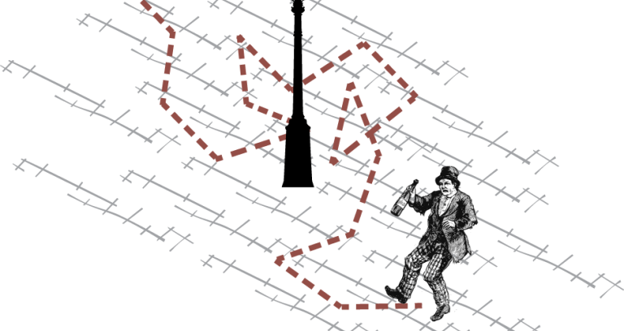

---
title: " Random Walks Models"
author: <font size="5"> Son Nguyen </font>
output:
  xaringan::moon_reader:
    css: [default, metropolis, metropolis-fonts]
    lib_dir: libs
    nature:
      highlightStyle: github
      highlightLines: true
      countIncrementalSlides: false
      slideNumberFormat: |
        <div class="progress-bar-container">
          <div class="progress-bar" style="width: calc(%current% / %total% * 100%);">
          </div>
        </div>`
---

<style>

.remark-slide-content {
  background-color: #FFFFFF;
  border-top: 80px solid #F9C389;
  font-size: 17px;
  font-weight: 300;
  line-height: 1.5;
  padding: 1em 2em 1em 2em
}

.inverse {
  background-color: #696767;
  border-top: 80px solid #696767;
  text-shadow: none;
  background-image: url(https://github.com/goodekat/presentations/blob/master/2019-isugg-gganimate-spooky/figures/spider.png?raw=true);
	background-position: 50% 75%;
  background-size: 150px;
}

.your-turn{
  background-color: #8C7E95;
  border-top: 80px solid #F9C389;
  text-shadow: none;
  background-image: url(https://github.com/goodekat/presentations/blob/master/2019-isugg-gganimate-spooky/figures/spider.png?raw=true);
	background-position: 95% 90%;
  background-size: 75px;
}

.title-slide {
  background-color: #F9C389;
  border-top: 80px solid #F9C389;
  background-image: none;
}

.title-slide > h1  {
  color: #111111;
  font-size: 40px;
  text-shadow: none;
  font-weight: 400;
  text-align: left;
  margin-left: 15px;
  padding-top: 80px;
}
.title-slide > h2  {
  margin-top: -25px;
  padding-bottom: -20px;
  color: #111111;
  text-shadow: none;
  font-weight: 300;
  font-size: 35px;
  text-align: left;
  margin-left: 15px;
}
.title-slide > h3  {
  color: #111111;
  text-shadow: none;
  font-weight: 300;
  font-size: 25px;
  text-align: left;
  margin-left: 15px;
  margin-bottom: -30px;
}

</style>

```{css, echo=FALSE}
.left-code {
  color: #777;
  width: 48%;
  height: 92%;
  float: left;
}
.right-plot {
  width: 51%;
  float: right;
  padding-left: 1%;
}
```

```{r setup, include = FALSE}

# R markdown options
knitr::opts_chunk$set(echo = FALSE, 
                      fig.width = 10,
                      fig.height = 5,
                      fig.align = "center", 
                      message = FALSE,
                      warning = FALSE)

# Load packages
library(tidyverse)
library(forecast)
```


# White Noise

-   $y_t$ is a white-noise process (series) if $y_1$, $y_2$,..., $y_t$ are independent identical distributed (iid) zero mean random variables from a certain distribution (usually normal)

---
# Example

```{r}
set.seed(30)
y <- ts(rnorm(100))
library(ggfortify)
autoplot(y) + ggtitle("White noise of Standard Normal Distribution")
```
---
# Example

```{r}
set.seed(30)

y = sample(c(-1, 1), 100, replace = TRUE)

y <- ts(y)
library(ggfortify)
autoplot(y) + ggtitle("White noise of Tossing a Coin")
```
---
# Correlogram

- Autocorrelation lag with lag k is the the correlation between the time series $y_t$ and $y_{t-k}$


- Autocorrelation lag with lag 0 is always 1

- The Correlogram is the plot of the autocorrelations for values of lag k = 0, 1, 2,...

---
# Correlogram a white noise

- Correlogram of a white noise

```{r}
# create a white-noise time series
y = ts(rnorm(100))

# plot its ACF or correlogram 
acf(y)
```

---
# Correlogram a white noise

```{r}
set.seed(30)
y = sample(c(-1, 1), 100, replace = TRUE)

y <- ts(y)

acf(y)

```

---
# Correlogram a time series with trend

- Usually a trend in the data will show in the correlogram as a slow decay in the autocorrelation

```{r}
y = ts(c(1:100))
acf(y)
```

---
# The Correlogram - Example

```{r}
y = ts(cos(c(1:100))+rnorm(100))
acf(y)
```

---
# ACF of a time series with seasonality

```{r}
set.seed(30)
y = cos(1:100)
y <- ts(y)
acf(y)
```

---
# Random Walk

-   A time series $y_t$ is called a random walk if

    $$y_{t} =  y_{t-1} +  \epsilon_t,$$

    where $\epsilon_t$ is a white-noise

-   A random walk can be written as

$$
y_t = y_0 + \epsilon_1 + \epsilon_2 +...+\epsilon_t
$$

---
# Example

```{r}
set.seed(1)
n <- 5
ct = sample(c(-1, 1), n, TRUE)
x <- cumsum(c(0,ct))
plot(ts(x))
```

---
# Example

```{r}
set.seed(1)
n <- 1000
ct = c(0, sample(c(-1, 1), n, TRUE))
x <- cumsum(ct)
plot(ts(x))
```

---
# Example

```{r}
set.seed(3000)
n = 100
c <- rnorm(n)
y_0 = 0
y = c(y_0, 2:n)
for (i in 2:n)
{
  y[i] = y[i-1]+c[i]
}
y = ts(y)
plot(y) 
```

---
# Random Walk with drift

-   A time series $y_t$ is called a random walk if

    $$y_{t} =  y_{t-1} +  d + \epsilon_t,$$

    where $\epsilon_t$ is a white-noise

-   A random walk can be written as

$$
y_t = y_0 + dt + \epsilon_1 + \epsilon_2 +...+\epsilon_t
$$

---
# Example

.left-code[
```{r step1281110, eval = FALSE, echo = TRUE}
set.seed(30)
n = 1000
c <- rnorm(n, sd = 20)
y_0 = 0
drift = 5

y = c(y_0, 2:n)

for (i in 2:n)
{
  y[i] = drift  + y[i-1]+c[i]
}

library(ggfortify)
library(latex2exp)

plot(ts(y)) 
title(paste0("A random walk with drift ", drift))
```
]
.right-plot[
```{r, ref.label = "step1281110", echo = FALSE, cache = TRUE, fig.height = 6, fig.width = 7}
```
]

---
# The ACF of Random Walks

```{r}
n = 100
error_mean = 0
c <- rnorm(n, mean = error_mean, sd = 30)
y_0 = 0
y = c(y_0, 2:n)

for (i in 2:n)
{
  y[i] = y[i-1]+c[i]
}

acf(y)
```

---
# Differencing Time Series

.left-code[
```{r s1, eval = FALSE, echo = TRUE}
n = 100
error_mean = 0
drift = 100
c <- rnorm(n, mean = error_mean, sd = 30)
y_0 = 0
y = c(y_0, 2:n)

for (i in 2:n)
{
  y[i] = drift + y[i-1]+c[i]
}

y = ts(y)

plot(y)
```
]
.right-plot[
```{r, ref.label = "s1", echo = FALSE, cache = TRUE, fig.height = 6, fig.width = 7}
```
]
---

```{r}
plot(diff(y))
```

---

```{r}
acf(y)
```

---

```{r}
acf(diff(y))
```

---
# Quantmod Package

https://www.quantmod.com/


---
# Random Walks and Stocks

```{r}
library(quantmod)
getSymbols('MSFT', src='yahoo')
y = Ad(MSFT[index(MSFT)>"2023-01-01",])

plot(y)
plot(diff(y))
```

---

```{r}
acf(diff(y), na.action = na.pass)
```

---

- The differencing series could be a white noise

- It is very reasonable to assume that the stock follows the random walk model. 

---
class: middle, inverse, center

# Time Series Decomposition

---
# Basic Idea

- We forecast the time series of interest  $y$ assuming that it has a linear relationship with other time series  $x$.

---
# Simple linear regression

```{r}
library(fpp3)
us_change |>
  pivot_longer(c(Consumption, Income), names_to="Series") |>
  autoplot(value) +
  labs(y = "% change")
```

---
# Simple linear regression

```{r}
us_change |>
  ggplot(aes(x = Income, y = Consumption)) +
  labs(y = "Consumption (quarterly % change)",
       x = "Income (quarterly % change)") +
  geom_point() +
  geom_smooth(method = "lm", se = FALSE)
```


---
# Simple linear regression

```{r}
us_change |>
  select(-Consumption, -Income) |>
  pivot_longer(-Quarter) |>
  ggplot(aes(Quarter, value, colour = name)) +
  geom_line() +
  facet_grid(name ~ ., scales = "free_y") +
  guides(colour = "none") +
  labs(y="% change")
```


---
# Simple linear regression

```{r}
us_change |>
  GGally::ggpairs(columns = 2:6)
```


---
# Simple linear regression

```{r}
fit_consMR <- us_change |>
  model(tslm = TSLM(Consumption ~ Income + Production +
                                    Unemployment + Savings))
report(fit_consMR)

```

---
# Simple linear regression

```{r}
augment(fit_consMR) |>
  ggplot(aes(x = Quarter)) +
  geom_line(aes(y = Consumption, colour = "Data")) +
  geom_line(aes(y = .fitted, colour = "Fitted")) +
  labs(y = NULL,
    title = "Percent change in US consumption expenditure"
  ) +
  scale_colour_manual(values=c(Data="black",Fitted="#D55E00")) +
  guides(colour = guide_legend(title = NULL))
```


---
# Simple linear regression

```{r}
augment(fit_consMR) |>
  ggplot(aes(x = Consumption, y = .fitted)) +
  geom_point() +
  labs(
    y = "Fitted (predicted values)",
    x = "Data (actual values)",
    title = "Percent change in US consumption expenditure"
  ) +
  geom_abline(intercept = 0, slope = 1)
```


---
# Simple linear regression


```{r}
fit_consMR |> gg_tsresiduals()

```


---

```{r}
us_change |>
  left_join(residuals(fit_consMR), by = "Quarter") |>
  pivot_longer(Income:Unemployment,
               names_to = "regressor", values_to = "x") |>
  ggplot(aes(x = x, y = .resid)) +
  geom_point() +
  facet_wrap(. ~ regressor, scales = "free_x") +
  labs(y = "Residuals", x = "")

```


---
class: center, middle, inverse

# Review

---
**Holt’s Exponential Smoothing**

```{r}
skirts <- read.csv('data/skirts.csv')
ts2 <- ts(skirts,start=c(1866))
plot(ts2)
```

---

```{r}
ts2_forecast <- HoltWinters(ts2, alpha=TRUE, 
                            beta=TRUE, 
                            gamma=FALSE)
ts2_forecast
```

---

```{r}
plot(ts2_forecast)
```

---

```{r}
ts2_forecast2 <- forecast(ts2_forecast, h=19)
plot(ts2_forecast2)
```

---
class: center, inverse, middle

# Holt-Winters Exponential Smoothing

---
```{r}
souvenir <- read.csv('data/souvenir.csv')
ts3 <- ts(souvenir, frequency=12, start=c(1987,1))
plot(ts3)
```


---
```{r}
ts3_forecasts <- HoltWinters(ts3, alpha=TRUE, 
                            beta=TRUE, 
                            gamma=TRUE)
plot(ts3_forecasts)
```


---
```{r}
ts3_forecasts2 <- forecast(ts3_forecasts, h=48)
plot(ts3_forecasts2)
```


---

```{r, eval=FALSE}
souvenir <- read.csv('data/souvenir.csv')
ts3 <- ts(souvenir, frequency=12, start=c(1987,1))
logts3 <- log(ts3)
ts3_forecasts <- HoltWinters(logts3)
plot(ts3_forecasts)
ts3_forecasts2 <- forecast(ts3_forecasts, h=48)
plot(ts3_forecasts2)
```


---

- The parameters alpha, beta and gamma all have values between 0 and 1.

- Values that are close to 0 mean that relatively little weight is placed on the most recent observations (the weights are spread out for the past observations) when making forecasts of future values.

- Alpha estimates the level

- Beta estimate the slopes of the trend component

- Gamma estimate the slope of the seasonal component
