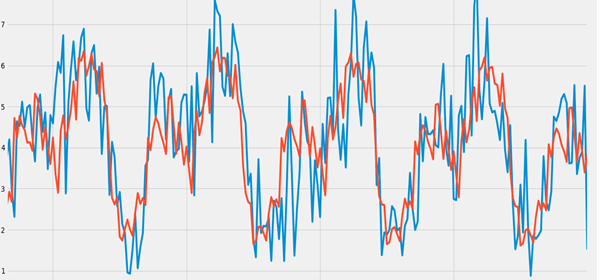

---
title: " Autoregressive Models"
author: <font size="5"> Son Nguyen </font>
output:
  xaringan::moon_reader:
    css: [default, metropolis, metropolis-fonts]
    lib_dir: libs
    nature:
      highlightStyle: github
      highlightLines: true
      countIncrementalSlides: false
      slideNumberFormat: |
        <div class="progress-bar-container">
          <div class="progress-bar" style="width: calc(%current% / %total% * 100%);">
          </div>
        </div>`
---

<style>

.remark-slide-content {
  background-color: #FFFFFF;
  border-top: 80px solid #F9C389;
  font-size: 17px;
  font-weight: 300;
  line-height: 1.5;
  padding: 1em 2em 1em 2em
}

.inverse {
  background-color: #696767;
  border-top: 80px solid #696767;
  text-shadow: none;
  background-image: url(https://github.com/goodekat/presentations/blob/master/2019-isugg-gganimate-spooky/figures/spider.png?raw=true);
	background-position: 50% 75%;
  background-size: 150px;
}

.your-turn{
  background-color: #8C7E95;
  border-top: 80px solid #F9C389;
  text-shadow: none;
  background-image: url(https://github.com/goodekat/presentations/blob/master/2019-isugg-gganimate-spooky/figures/spider.png?raw=true);
	background-position: 95% 90%;
  background-size: 75px;
}

.title-slide {
  background-color: #F9C389;
  border-top: 80px solid #F9C389;
  background-image: none;
}

.title-slide > h1  {
  color: #111111;
  font-size: 40px;
  text-shadow: none;
  font-weight: 400;
  text-align: left;
  margin-left: 15px;
  padding-top: 80px;
}
.title-slide > h2  {
  margin-top: -25px;
  padding-bottom: -20px;
  color: #111111;
  text-shadow: none;
  font-weight: 300;
  font-size: 35px;
  text-align: left;
  margin-left: 15px;
}
.title-slide > h3  {
  color: #111111;
  text-shadow: none;
  font-weight: 300;
  font-size: 25px;
  text-align: left;
  margin-left: 15px;
  margin-bottom: -30px;
}

</style>

```{css, echo=FALSE}
.left-code {
  color: #777;
  width: 48%;
  height: 92%;
  float: left;
}
.right-plot {
  width: 51%;
  float: right;
  padding-left: 1%;
}
```

```{r setup, include = FALSE}

# R markdown options
knitr::opts_chunk$set(echo = FALSE, 
                      fig.width = 10,
                      fig.height = 5,
                      fig.align = "center", 
                      message = FALSE,
                      warning = FALSE)

# Load packages
library(tidyverse)
library(forecast)
```

# Stationary

-   A time series $y_t$ is stationary if

    -   $E(y_t) = constant$

    -   $Cov(y_t, y_s)$ only depends on the time lag $|t-s|$

-   If $y_t$ is stationary then $Var(y_t) = Constant$

---
# Example

```{r}
set.seed(30)
n = 100
e <- ts(rnorm(n, sd = 10))
t = c(1:n)
y = 2*t+3+e
library(ggfortify)
autoplot(y) + ggtitle("")
```

---
# Example

```{r}
set.seed(30)
n = 100
e <- ts(rnorm(n, sd = 10))
t = c(1:n)
y = 2*t+3+e
library(ggfortify)
autoplot(y) + ggtitle("Non-stationary due to non-constant expected value")
```

---
# Example

```{r}
set.seed(30)
n = 100
e1 <- rnorm(n, sd = 1)
e2 <- rnorm(n, sd = 10)
e3 <- rnorm(n, sd = 50)
y = c(e1,e2,e3)
library(ggfortify)
autoplot(ts(y)) + ggtitle("")
```

---
# Example

```{r}
set.seed(30)
n = 100
e1 <- rnorm(n, sd = 1)
e2 <- rnorm(n, sd = 10)
e3 <- rnorm(n, sd = 50)
y = ts(c(e1,e2,e3))
library(ggfortify)
autoplot(y) + ggtitle("Non-stationary due to non-constant variance")
```

---
# Example

```{r}
set.seed(10)
y <- ts(rnorm(200))
library(ggfortify)
autoplot(y) + ggtitle("")
```

---
# Example

- White Noise is stationary

```{r}
set.seed(10)
y <- ts(rnorm(200))
library(ggfortify)
autoplot(y) + ggtitle("A Stationary Time Series")
```


---
# Example

- Random Walk is not stationary


```{r}
set.seed(10)
y <- arima.sim(list(order=c(0,1,0)), n=1000)
library(ggfortify)
autoplot(y) + ggtitle("A Non-Stationary Time Series")
```

---

- Series with trend or seasonality are not stationary

---
# Autoregressive model

$$y_{t} = \beta_0 + \beta_1 y_{t-1} + \epsilon_t,$$

-   If $\beta_1 > 1$, the series will diverge

-   If $\beta_1 = 1$, the series becomes a random walk model.

-   If $\beta_1 = 0$, the series becomes a white noise.

-   If $|\beta_1|<1$, the series is convergent and stationary

---
# Autoregressive model - AR(1)

-   A time series $y_t$ is called a *first-order autoregressive model*, or AR(1) if

$$y_{t} = \beta_0 + \beta_1 y_{t-1} + \epsilon_t,$$

where $|\beta_1| \leq 1$, $\epsilon_t \sim (0, \sigma^2)$  and $\epsilon_{t+k}$ is independent of $y_t$ for any $t >0$ and $k>0$.

- Three parameters of the models are $\beta_0, \beta_1,$ and $\sigma^2$

- AR(1) can also be written as

$$y_{t} - \mu = \beta_1 (y_{t-1}-\mu) + \epsilon_t,$$

where $\beta_0 = \mu(1-\beta_1)$. Here, $\mu$ is the mean of the series. 

---
# AR(1)

.left-code[
```{r s1, eval = FALSE, echo = TRUE}
library(ggfortify)
set.seed(2023)
n = 1000
y = rep(0, n)

y[1] = 0
b0 = 0
b1 = .01
e = rnorm(n, sd = 1)

for (t in 2:n)
{
  y[t] = b0 + b1*y[t-1]+e[t]
}

autoplot(ts(y)) + ggtitle(paste0("An Autoregressive series with beta1 = ",b1))

```
]
.right-plot[
```{r, ref.label = "s1", echo = FALSE, cache = TRUE, fig.height = 6, fig.width = 7}
```
]

---
# AR(1)

.left-code[
```{r s2, eval = FALSE, echo = TRUE}
set.seed(2023)
n = 1000
y = rep(0, n)

y[1] = 0
b0 = 0
b1 = .5
e = rnorm(n, sd = 1)

for (t in 2:n)
{
  y[t] = b0 + b1*y[t-1]+e[t]
}

autoplot(ts(y)) + ggtitle(paste0("An Autoregressive series with beta1 = ",b1))

```
]
.right-plot[
```{r, ref.label = "s2", echo = FALSE, cache = TRUE, fig.height = 6, fig.width = 7}
```
]

---
# AR(1)

.left-code[
```{r s3, eval = FALSE, echo = TRUE}
set.seed(2023)
n = 1000
y = rep(0, n)

y[1] = 0
b0 = 0
b1 = .9
e = rnorm(n, sd = 1)

for (t in 2:n)
{
  y[t] = b0 + b1*y[t-1]+e[t]
}

autoplot(ts(y)) + ggtitle(paste0("An Autoregressive series with beta1 = ",b1))

```
]
.right-plot[
```{r, ref.label = "s3", echo = FALSE, cache = TRUE, fig.height = 6, fig.width = 7}
```
]

---
# AR(1)

.left-code[
```{r s4, eval = FALSE, echo = TRUE}
set.seed(2023)
n = 1000
y = rep(0, n)

y[1] = 0
b0 = 0
b1 = 1
e = rnorm(n, sd = 1)

for (t in 2:n)
{
  y[t] = b0 + b1*y[t-1]+e[t]
}

autoplot(ts(y)) + ggtitle(paste0("An Autoregressive series with beta1 = ",b1))

```
]
.right-plot[
```{r, ref.label = "s4", echo = FALSE, cache = TRUE, fig.height = 6, fig.width = 7}
```
]


---
# AR(1)

.left-code[
```{r s5, eval = FALSE, echo = TRUE}
set.seed(2023)
n = 1000
y = rep(0, n)

y[1] = 0
b0 = 0
b1 = 1.1
e = rnorm(n, sd = 1)

for (t in 2:n)
{
  y[t] = b0 + b1*y[t-1]+e[t]
}

autoplot(ts(y)) + ggtitle(paste0("An Autoregressive series with beta1 = ",b1))

```
]
.right-plot[
```{r, ref.label = "s5", echo = FALSE, cache = TRUE, fig.height = 6, fig.width = 7}
```
]

---
# Simulating AR(1)

- We can conveniently simulate AR(1) using `arima.sim` function

```{r}
yt <- arima.sim(list(order=c(1,0,0), ar=.7), n=1000)
b0 = 10
yt <- yt + b0
plot(yt)
```

---
# ACF

- For a positive value of $\beta_1$ the ACF exponentially decreases to 0 as the lag increases

```{r}
yt <- arima.sim(list(order=c(1,0,0), ar=.9), n=1000)
b0 = 10
yt <- yt + b0
acf(yt)
```

---
# ACF

- For negative $\beta_1$ the ACF also exponentially decays to 0 as the lag increases, but the algebraic signs for the autocorrelations alternate between positive and negative

```{r}
yt <- arima.sim(list(order=c(1,0,0), ar=-.9), n=1000)
b0 = 10
yt <- yt + b0
acf(yt)
```


---
class: center, middle, inverse
# Parameter Estimation

---
# Parameter Estimation

-   AR(1) is very similar to linear model where $y_{t-1}$ play the roles of the predictor and $y_{t}$ is the response

-   In linear model, the predictor $x$ is assumed to be non-random while the predictor $y_{t-1}$ is non-random in AR(1)

-   We estimate $\beta_0$ and $\beta_1$ by minimizing

$$\sum_{t=2}^T\bigg(y_t-E(y_t|y_{t-1})\bigg)^2 = \sum_{t=2}^T\bigg(y_t-\beta_0-\beta_1y_{t-1}\bigg)^2$$

-   These estimators are called the conditional least squares estimators

---
# Parameter Estimation

The coefficients are estimated by 

$$\hat{\beta}_1 = \frac{\sum_{t=2}^T(y_{t-1}-\bar{y})(y_t-\bar{y})}{\sum^T_{t=2}(y_t-\bar{y})^2}\\
    \hat{\beta}_0 = \bar{y}(1-\hat{\beta_1})$$

The only parameter left to estimate is the error variance, $\sigma^2_{\epsilon}$, (error mean is zero), which can be estimated by $s^2$ 

$$s^2 = \frac{\sum_{t=2}^T(e_t-\bar{e})^2}{T-3}$$

where $e_t = y_t - (\hat{\beta}_0-\hat{\beta}_1y_{t-1})$.

---
# Example

You are given the following six observed values of the autoregressive model of order one time series

$$y_t = \beta_0 + \beta_1 y_{t-1} + \epsilon_t, \text{ with   }  Var(\epsilon_t) = \sigma^2.$$

| $t$   | 1   | 2   | 3   | 4   | 5   |
|:------|:----|:----|:----|:----|:----|
| $y_t$ | 1   | 3   | 5   | 8   | 13  |

Calculate $\hat{\beta}_1$ using the conditional least squares method.


---
# Parameter Estimation in R

- We can estimate the coefficients of AR(1) using the `arima` function

```{r}
yt <- arima.sim(list(order=c(1,0,0), ar=c(.7)), n=1000)

b0 = 10

yt <- yt + b0

plot(yt)

arima(yt, order = c(1,0,0))
```

---
# Parameter Estimation in R

- We can estimate the coefficients of AR(1) using the `arima` function

```{r}
arima(yt, order = c(1,0,0))
```

- We see that the estimated coefficients are close to the true values. 

---
class: center, middle, inverse
# Forecasting with AR(1)

---
# Forecasting with AR(1)

-   Suppose we have the AR(1) time series with known $\beta_0$ and $\beta_1$. If these parameters are unknown we can estimate them by the formula in the previous slices.

-   We use the following formulas to for forecasting

$$\hat{y}_{T+1} = \beta_0 + \beta_1 y_T$$

$$\hat{y}_{T+k} = \mu + \beta_1^k(y_T - \mu)$$

where $\mu = \frac{\beta_0}{1- \beta_1}$.

---
# Example

You are given 

$$y_t = .3y_{t-1} + 4 +\epsilon$$
$$y_T = 7$$ 

Calculate the three step ahead forecast of $y_{T+3}$

---
# Forecasting with AR(1)

```{r}

# create an AR(1) series
yt <- arima.sim(list(order=c(1,0,0), ar=c(.2)), n=100)
b0 = 10
yt <- yt + b0
plot(yt)
```

---
# Forecasting with AR(1)

```{r}

# estimate the series using AR(1) model
yt_ar  = arima(yt, order = c(1,0,0))

# plot the estimated series and the original series
yt_predicted <- yt - yt_ar$residuals

plot(yt)
points(yt_predicted, type = "l", 
       col = "red", lty = 2)

# calculate Mean Absolute Error - MAE
mae = mean(abs(yt_ar$residuals))

# Mean Absolute Percentage Error
mape = mean(abs(yt_ar$residuals/yt))
mae
mape
```

---
# Forecasting with AR(1)

```{r}
hist(yt_ar$residuals)
```


---
# Forecasting with AR(1)

```{r}
acf(yt_ar$residuals)
```
- The ACF of the error is similar to that of a white-noise. 

---
# Forecasting with AR(1)

```{r}
ts3_forecasts2 <- forecast(yt_ar, h=5)
plot(ts3_forecasts2)
```

---
class: center, middle, inverse

# Differencing technique


---
# Differencing technique

- A series should be stationary to be modeled by the AR(1) model.

- If the series is not stationary, one can de-trend the series using the differencing technique.

- The differenced series then can potentially stationary and can be modeled by the AR(1) model for forecasting

---
# Example

```{r}
library(quantmod)
library(forecast)
getSymbols("AAPL")
yt = AAPL$AAPL.Open
yt <- yt[index(yt) > "2023-01-01"]
```

---

```{r}
acf(yt, lag.max = 100)
```

- Looking at the ACF, we observe that the correlations does not die out to zero but later go out of the blue lines. 
- Thus this series is non-stationary and it is not reasonable to model the stock using the AR model. 
- We will use a differencing technique to transform the stock to a stationary series. Consider the difference stock

---

$$d_{n} = y_{n+1} - y_n$$

```{r}
d_AAPL = ts(as.numeric(diff(yt))[-1])
acf(d_AAPL, lag.max = 100)
```

- The ACF plot shows that the difference series is stationary and can be model by an AR model.

---
The ACF plot shows that the difference series is stationary and can be model by an AR model.

```{r}
ar_AAPL = arima(d_AAPL, order = c(1,0,0))
ar_AAPL
```

---
- Forecast the next observation of $d_n$. 

```{r}
d_n = forecast(ar_AAPL, h = 1)
```

- Notice that $y_{n+1} = y_n + d_n$, we can forecast $y_{n+1}$ using $y_n$ and $d_n$

```{r, warning=FALSE}
y_next = d_n$mean + yt[length(yt)]
y_next = as.numeric(y_next)
y_next
```
