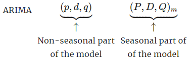

---
title: "ARIMA Models (2)"
author: <font size="5"> Son Nguyen </font>
output:
  xaringan::moon_reader:
    css: [default, metropolis, metropolis-fonts]
    lib_dir: libs
    nature:
      highlightStyle: github
      highlightLines: true
      countIncrementalSlides: false
      slideNumberFormat: |
        <div class="progress-bar-container">
          <div class="progress-bar" style="width: calc(%current% / %total% * 100%);">
          </div>
        </div>`
---

<style>

.remark-slide-content {
  background-color: #FFFFFF;
  border-top: 80px solid #F9C389;
  font-size: 17px;
  font-weight: 300;
  line-height: 1.5;
  padding: 1em 2em 1em 2em
}

.inverse {
  background-color: #696767;
  border-top: 80px solid #696767;
  text-shadow: none;
  background-image: url(https://github.com/goodekat/presentations/blob/master/2019-isugg-gganimate-spooky/figures/spider.png?raw=true);
	background-position: 50% 75%;
  background-size: 150px;
}

.your-turn{
  background-color: #8C7E95;
  border-top: 80px solid #F9C389;
  text-shadow: none;
  background-image: url(https://github.com/goodekat/presentations/blob/master/2019-isugg-gganimate-spooky/figures/spider.png?raw=true);
	background-position: 95% 90%;
  background-size: 75px;
}

.title-slide {
  background-color: #F9C389;
  border-top: 80px solid #F9C389;
  background-image: none;
}

.title-slide > h1  {
  color: #111111;
  font-size: 40px;
  text-shadow: none;
  font-weight: 400;
  text-align: left;
  margin-left: 15px;
  padding-top: 80px;
}
.title-slide > h2  {
  margin-top: -25px;
  padding-bottom: -20px;
  color: #111111;
  text-shadow: none;
  font-weight: 300;
  font-size: 35px;
  text-align: left;
  margin-left: 15px;
}
.title-slide > h3  {
  color: #111111;
  text-shadow: none;
  font-weight: 300;
  font-size: 25px;
  text-align: left;
  margin-left: 15px;
  margin-bottom: -30px;
}

</style>

```{css, echo=FALSE}
.left-code {
  color: #777;
  width: 48%;
  height: 92%;
  float: left;
}
.right-plot {
  width: 51%;
  float: right;
  padding-left: 1%;
}
```

```{r setup, include = FALSE}

# R markdown options
knitr::opts_chunk$set(echo = TRUE, 
                      fig.width = 10,
                      fig.height = 5,
                      fig.align = "center", 
                      message = FALSE,
                      warning = FALSE)

# Load packages
library(tidyverse)
library(forecast)
```

# ARIMA Models

The ARIMA models is a combination of three models:

(1) The Autoregressive Models  (AR)

(2) The Integrated Models (I)

(3) The Moving Average Models (MA)

Last week we already see the combination of an `AR` and `MA` components into a `ARMA.` This week, we will add an `I` component into ARMA to obtain `ARIMA`

---
# ARMA Models

- ARMA(p,q) is a combination of AR(p) and MA(q)

- ARMA(p, q) is a stationary process and can be used to model a stationary series

---
# ARMA Models

- But `ARMA` cannot be fitted to a non-stationary series.

- What if we still want to use `ARMA` on a non-stationary series?

- We could use the `differencing technique` as discussed earlier (week 6) for AR models. 


---
class: inverse, center, middle
# ARMA and Differencing

---
# ARMA and Differencing

- Consider the following series.

- [Download Series 1](y1.csv)

```{r}
y = read.csv('y1.csv')
y = ts(y$y1)
plot(y)
```


---
# ARMA and Differencing

- We see that the series is not stationary as it has trend. Thus, we cannot fit an ARMA model to this series. 

- Let plot the differenced series. 

```{r}
d1 = diff(y)
plot(d1)
```

- We can see that the differenced series d1 looks stationary and can be fitted by an ARMA model. 
---
# ARMA and Differencing

- Sometime we need to apply the differencing technique multiple times. Consider the following series.

- [Download Series 2](y2.csv)

```{r}
y = read.csv('y2.csv')
y = ts(y$y2)
plot(y)
```

---
# ARMA and Differencing

Since the series is non-stationary (as it has trend), we take a look at the differenced series.

```{r}
d1 = diff(y)
plot(d1)
```

- The differenced series still has trend and thus, cannot be fitted by an ARMA model. 


---
# ARMA and Differencing

We take a look at the differenced series of the differenced series.

```{r}
d2 = diff(d1)
plot(d2)
```

- Not that the `double` differenced series looks stationary, we could fit an ARMA to the `double` series. 

---
# ARMA and Differencing

- Although we could combine the differencing technique and `ARMA` model to cover (fit) non-stationary series, this is cumbersome/time consuming.  

- Why? This is because to make a forecast on the original series $y_t$ we need to work backward from the double differenced series to the differenced series then to the original series. 

- It is even more cumbersome when we need to difference the series 3, 4... times before it can be fitted by an ARMA model.

- This motivates the creation of the ARIMA model. 

---
class: inverse, center, middle 
# ARIMA Models

---
# ARIMA Models

- ARIMA(p, d, q) integrates the differencing technique into the model. The parameter $d$ is the number of time we need to difference the series to stationarize the series. 

- Thus, ARIMA can model a trend series. 

---
# ARIMA Models

- In the series 2 in the previous example, we difference the series two times ($d=2$) before fitting an ARMA(p, q) to it

- We can just fit an `ARIMA(p, 2, q)` to the series directly. 

```{r}
plot(y)
```

---
class: inverse, middle, center
# Backshift Notation

---
# Backshift Notation

The backward shift operator is useful when working with time series lags

$$By_t = y_{t-1}$$

We have 

$$B^2y_t = B(By_t) = By_{t-1} = y_{t-2}$$
In general, 

$$B^ky_t = y_{t-k}$$


---
# Example

Rewrite the following model using the backshift notation

$$y_t = 1 -.2y_{t-1}+.3y_{t-2}+\epsilon_t$$


---
# Example

Rewrite the following model using the backshift notation

$$y_t = 1 -.2y_{t-1}+.3y_{t-2}+\epsilon_t$$
We have: 

$$y_t = 1 -.2By_{t}+.3B^2y_{t}+\epsilon_t$$

---
# Backshift and AR

Let rewrite the AR(p) models using the backshift notation.  We have

$$y_t = \beta_0 + \beta_1 y_{t-1} + \beta_2 y_{t-2} +...+ \beta_p y_{t-p} + \epsilon_t$$
Or equivalently, 

$$y_t = \beta_0 + \beta_1 By_{t} + \beta_2 B^2 y_{t} +...+ \beta_p B^p y_{t} + \epsilon_t$$

$$y_t -  \beta_1 By_{t} - \beta_2 B^2 y_{t} -...- \beta_p B^p y_{t} = \beta_0 + \epsilon_t$$

Or,

$$\bigg(1 -  \beta_1 B - \beta_2 B^2  -...- B^p\bigg) y_{t} = \beta_0 + \epsilon_t$$

---
# Backshift and MA

Similarly, we can rewrite the MA(q) models using the backshift notation. We have

\begin{align}
y_t & = \mu  + \theta_1 \epsilon_{t-1} +...+\theta_q \epsilon_{t-q} + \epsilon_t \\
    & = \mu  + \theta_1 B\epsilon_{t} +...+\theta_q B^q \epsilon_{t} + \epsilon_t \\
    & = \mu  + \bigg( 1+ \theta_1 B +...+\theta_q B^q \bigg)\epsilon_t
\end{align}

---
# Backshift and ARMA

We have the ARMA:

$$y_t = \beta_0 + \beta_1 y_{t-1} + \beta_2 y_{t-2} +...+ \beta_p y_{t-p} +  \theta_1 \epsilon_{t-1} +...+\theta_q \epsilon_{t-q} + \epsilon_t$$
Combining the rewritten AR and MA, we have 

$$y_t - \beta_1 By_{t} - \beta_2 B^2 y_{t} -...- \beta_p B^p y_{t} = \beta_0 + \bigg( 1+ \theta_1 B +...+\theta_q B^q \bigg)\epsilon_t$$

Or, 

$$\bigg(1 -  \beta_1 B - \beta_2 B^2  -...- B^p\bigg) y_{t}  = \beta_0 + \bigg( 1+ \theta_1 B +...+\theta_q B^q \bigg)\epsilon_t$$


---
# Backshift and ARIMA

- In ARMA(p, q), if we replace $y_t$ by its $d^{th}$ order differenced series, we will obtain an ARIMA(p, d, q) model. 

- We first obtain the the $d^{th}$ order differenced series in term of the backshift notation. 

- Let $s_d$ be the $d$ order differenced series of $y_t$.  We have 

\begin{align}
s_1 &= y_t - y_{t-1} \\
    &= y_t - By_t \\
    &= (1-B)y_t
\end{align}

Similarly,

\begin{align}
s_2 &= (1-B)y_t - (1-B)y_{t-1} \\
    &= (1-B)(y_t-y_{t-1})\\
    &= (1-B)^2y_t
\end{align}

In general, we have

$$s_d = (1-B)^dy_t$$

- We now can rewrite all the three components of the ARIMA using the backshift notation. 


---
# Backshift and ARIMA

The ARIMA(p, d, q) model is defined as

$$\bigg(1 -  \beta_1 B - \beta_2 B^2  -...- B^p\bigg) \bigg(1-B \bigg)^d y_t  = \beta_0 + \bigg( 1+ \theta_1 B +...+\theta_q B^q \bigg)\epsilon_t$$

---
# Example

Write the equation of the ARIMA(1,1,1) 

- In terms of backshift notation

$$\bigg(1 -  \beta_1 B\bigg) \bigg(1-B \bigg) y_t  = \beta_0 + \bigg( 1+ \theta_1 B\bigg)\epsilon_t$$

- Expand this out and notice $By_t = y_{t-1}$ and $B^2y_t = y_{t-2}$, we have

\begin{align}
 & (1-\beta_1B-B+\beta_1B^2)y_t = \beta_0 + \epsilon + \theta_1B\epsilon_t \\
\implies & y_t - \beta_1By_t-By_t+\beta_1B^2y_t = \beta_0 + \epsilon_t + \theta_1B\epsilon_t \\
\implies & y_t -\beta_1 y_{t-1}- y_{t-1}+\beta_1y_{t-2} = \beta_0 + \epsilon_t + \theta_1\epsilon_{t-1}
\end{align}

Or, 

$$y_t = \beta_0 + (\beta_1 +1) y_{t-1} - \beta_1y_{t-2}  +  \epsilon_t + \theta_1\epsilon_{t-1}$$


---
# Example

Write the equation of the ARIMA(2,1,0) 

- In terms of backshift notation

$$\bigg(1 -  \beta_1 B -\beta_2B^2\bigg) \bigg(1-B \bigg) y_t  = \beta_0 + \epsilon_t$$

- Expand this out we have

\begin{align}
 & (1 - B - \beta_1B + \beta_1B^2 - \beta_2B^2 + \beta_2B^3)y_t = \beta_0 + \epsilon_t \\
\implies & y_t - By_t - \beta_1By_t + \beta_1B^2y_t - \beta_2B^2y_t + \beta_2B^3y_t = \beta_0 + \epsilon_t \\
\implies & y_t - y_{t-1} - \beta_1y_{t-1} + \beta_1y_{t-2} - \beta_2 y_{t-2} + \beta_2y_{t-3} = \beta_0 + \epsilon_t
\end{align}

Or, 

$$y_t = \beta_0 + y_{t-1} + \beta_1y_{t-1} - \beta_1y_{t-2} + \beta_2 y_{t-2} - \beta_2y_{t-3} +  \epsilon_t$$

---
# ARIMA

ARIMA covers a wide range of models as seen in the below table. 

| Model                  | ARIMA(p, d, q)                |
|------------------------|-------------------------------|
| White noise            | ARIMA(0,0,0)                  |
| Random walk            | ARIMA(0,1,0) with no constant |
| Random walk with drift | ARIMA(0,1,0) with a constant  |
| Autoregression         | ARIMA(p,0,0)                |
| Moving average         | ARIMA(0,0,q)                |

---
# ARIMA Simulation

- We use the `arima.sim` function to simulate data from the ARIMA models.  

- Let simulate ARIMA with $d = 2$.

```{r}
set.seed(2024)
y = arima.sim(list(order=c(1,2,2), ar=c(.1), ma = c(.1, .4)), n=100)
plot(y)
```

---
# ARIMA Simulation

The order $d = 2$ means that if we apply diffrencing two times, the series will be stationary

```{r}
d1 = diff(y)
d2 = diff(d1)
plot(d2)
```


---
# ARIMA Simulation

- Let simulate ARIMA with $d = 4$.

```{r}
set.seed(2024)
y = arima.sim(list(order=c(1,4,2), ar=c(.1), ma = c(.1, .4)), n=100)
plot(y)
```


---
# ARIMA Simulation

The order $d = 4$ means that if we apply diffrencing four times, the series will be stationary

```{r}
d1 = diff(y)
d2 = diff(d1)
d3 = diff(d2)
d4 = diff(d3)
plot(d4)
```


---
class: inverse, middle, center
# Parameters Estimation and Order selection

---
# Parameters Estimation

Suppose that we have a time series that we want to fit an ARIMA model to it. There are two decision needed to be made

- (1) The selection of the orders $p, d$ and $q$ (These are also called hyper-parameters). This will specify the equation of the ARIMA model. 

- (2) Once the orders are determined, we need to find the estimates for the parameters ($\beta_i$ and $\theta_i$) that give us the `best` fit. 

For (2) we could use the least squares method or the maximum likelihood method (resulting maximum likelihood estimates). 

---
# Order selection

We will discuss two approaches to select the order for the ARIMA.  

- Approach 1 is to use the user-defined function to do a brute-force search for the best combination of the orders (p, d, q) in the ranges of values for (p, d, q).

- Approach 2 is to use the Hyndman-Khandakar algorithm through the `auto.arima` function.

---
# Approach 1

To select the best orders $(p, d, q)$, we could use the following procedure.

1. Decide ranges of search for the orders. 
2. Fit all the ARIMA models with all possible the orders 
3. Calculate a model evaluation metric of all of the fitted models (this could be done on the same training dataset or a separate testing dataset). 
4. Find the best model (the parameters) according to the evaluation metric

---
# Model Evaluation Metrics

We will use the Akaike’s Information Criterion (AIC). 

$$\text{AIC} = -2\log (L) + 2(p+q+k+1)$$
where $L$ is the likelihood of the data, $k = 1$ if $\beta_0 \neq 0$ and $k = 0$ if $\beta_0 = 0$. 

We notice that

- The model with the lower AIC is the better model. 

- When the $p, q$ are increasing the ARIMA tends to have a greater (better) log likelihood. The second term of the AIC is the `cost` when increasing the values of $p, q$. This often makes AIC is a more desirable metric than the log likelihood or MAPE. 

---
# Example

We will consider a dataset of seasonally adjusted electrical equipment from January 1996 to March 2012. 

[Download Dataset](ee.csv)

```{r}
df = read.csv('ee.csv')
y = ts(df$electrical_equipment, start = 1996, frequency = 12)
plot(y)
```

---
# Example

We will set the ranges of the orders for the search as follows

- $p = 0, 1$
- $d = 0, 1$
- $q = 0, 1$

With these ranges, there will be 8 possible ARIMA model. We will fit all 8 models to the series. The best fit would be the one with lowest AIC. 

---
# Example

- We will the below function to search for the best orders of the ARIMA

```{r}
orders_search = function(series, 
                         p_orders= c(0:3), d_orders= c(0:3), q_orders= c(0:3))
{ library(forecast)
  df_aic = data.frame(p=double(), d =double(),
                      q= double(), MAPE= double(), 
                      loglik = double(), aic = double())
for (p in p_orders)
{ for (d in d_orders)
  { for (q in q_orders)
    { a = Arima(series, order = c(p, d, q))
      df_aic = rbind(df_aic, c(p, d, q, accuracy(a)[5], a$loglik,  a$aic ))
    } } }
names(df_aic) = c('p', 'd', 'q', 'MAPE' , 'log_likelihood', 'aic')
print('------------------------------------')
print('Some Model Evaluation Metrics')
print('------------------------------------')
print(df_aic)
print('------------------------------------')
print('The best model by AIC is:')
print('------------------------------------')
r= df_aic[which.min(df_aic$aic),]
row.names(r) = NULL
return(r)}
```

---
# Example

- Let apply the function to the series. 

```{r}
# Set the ranges for the orders
p_orders= c(0:1)
d_orders= c(0:1)
q_orders= c(0:1)
# Apply the function orders_search
orders_search(series = y, p_orders, d_orders, q_orders)
```

---
# Results

Some observations from the results

- The best model by AIC is $(p, d, q) = (1, 1, 0)$. 

- The `MAPE` is decreasing (better) when the total number of order are increasing

- The one with best (lowest) AIC is not the one with the best (greatest) log-likelihood. 

---
# Forecasting

Now that we decide to go with ARIME(1,1,0) to fit the series, we can use the fitted series for forecasting. 

```{r}
y_arima = arima(y, order = c(1,1,0))
y_forecast = forecast(y_arima)
plot(y_forecast)
```


---
class: inverse, middle, center
# Approach 2: The auto.arima function


---
# The auto.arima function

- The `auto.arima` function in the package `forecast` gives us another way to decide the order of the ARIMA and then fit this model to the data. 

- The uses of this function is as follows. 

```{r}
y_arima = auto.arima(y, seasonal = FALSE)
```

---
# The auto.arima function

```{r}
y_arima
```

- We see that ARIMA(3,1,0) has been chosen to fitted the series. 

---
# The auto.arima function

- After ARIMA(3,1,0) is chosen to fit the data. We can make forecast using this fitted model. 

```{r}
y_forecast = forecast(y_arima)
plot(y_forecast)
```

---
# The auto.arima function

- How did the `auto.arima` select ARIMA(3,1,0)? 

- The function uses a variation of the Hyndman-Khandakar algorithm to obtain an ARIMA model. 

- For more about the algorithm, you can read it at: 

https://www.jstatsoft.org/article/view/v027i03


---
class: inverse, middle, center
# Seasonal ARIMA Models

---
# Seasonal ARIMA Models

- We see that from ARIMA can handle trend series, but what about seasonal series?

- ARIMA(p,d,q) can model a trend series but cannot model a seasonal series

- Seasonal ARIMA or SARIMA add the ability to model a seasonal component to the ARIMA models

- So from ARMA -> ARIMA -> SARIMA, the effort is to enable the ARMA to model trend and seasonal series. 

---
# Seasonal ARIMA Models

- Seasonal ARIMA model is constructed by adding seasonal terms in the ARIMA(p, d, q). The seasonal term is also has three component Autoregression (AR), Integrated (I) and Moving Average (MA). 



- For similicity, we also assume that the constant $\beta_0 = 0$ in the discussion of SARIMA. 

---
# Seasonal ARIMA Models

- SARIMA has 7 parameters.  Let see the effect of each of these parameters on the model equation.

- Let start with the simplest SARIMA: $\text{SARIMA} (0,0,0) (0,0,0)_m$. Since all of the parameters are zeroes, the model is just a white-noise model. Or,

- $\text{SARIMA} (0,0,0) (0,0,0)_m$.

$$y_t = \epsilon_t$$
- In the very next model, we will start making some of the parameters to be non-zeroes.

- $\text{SARIMA}(1,0,0)(0,0,0)_m$

$$\big(1 -  \beta_1 B\big) y_t  = \epsilon_t$$

---
# Seasonal ARIMA Models

- $\text{SARIMA}(0,1,0)(0,0,0)_m$

$$\big(1 - B\big) y_t  = \epsilon_t$$
- $\text{SARIMA}(0,0,1)(0,0,0)_m$

$$y_t  = \big( 1+ \theta_1 B \big)\epsilon_t$$

- $\text{SARIMA}(0,0,0)(1,0,0)_m$

$$\big(1 -  \beta^{*}_1 B^{m}\big) y_t  = \epsilon_t$$

---
# Seasonal ARIMA Models

- $\text{SARIMA}(0,0,0)(0,1,0)_m$

$$\big(1 - B^{m}\big) y_t  = \epsilon_t$$

- $\text{SARIMA}(0,0,0)(0,0,1)_m$

$$y_t  = \big( 1+ \theta^{*}_1 B^m \big)\epsilon_t$$

---
# Example 1

Write the equation for $\text{ARIMA}(1,0,0)(1,0,0)_{12}$ and assume that $\beta_0 = 0$ .

This model starts with ARIMA(1,0,0) or AR(1) 

$$\big(1 -  \beta_1 B\big) y_t  = \epsilon_t$$

By applying the seasonal component to the equation, we have

$$\big(1 -  \beta_1 B\big)\big(1 -\beta^{*}_1 B^{12}\big) y_t  = \epsilon_t$$


---
# Example 2

Write the equation for $\text{ARIMA}(1,0,0)(0,0,1)_{12}$.  

This model starts with ARIMA(1,0,0) or AR(1)

$$\big(1 -  \beta_1 B\big) y_t  = \epsilon_t$$

By applying the seasonal component to the equation, we have

$$\big(1 - \beta_1 B\big) y_t  = \big( 1+ \theta^{*}_1 B^{12} \big)\epsilon_t$$

---
# Example 3

Write the equation for an $\text{ARIMA}(1,0,0)(0,1,0)_{12}$.  

This model starts with ARIMA(1,0,0) or AR(1)

$$\big(1 -  \beta_1 B\big) y_t  = \epsilon_t$$

By applying the seasonal component to the equation, we have

$$\big(1 -  \beta_1 B\big) \big(1-B^{12} \big) y_t  = \epsilon_t$$


---
# Example 4

- Write the equation for $\text{ARIMA}(1,1,1)(1,1,1)_4$

We start with $\text{ARIMA}(1,1,1)$

$$\big(1 -  \beta_1 B\big) \big(1-B \big) y_t  = \big( 1+ \theta_1 B \big)\epsilon_t$$

- Now we will add the seasonal component to this ARIMA. 

$$\big(1 -  \beta_1 B\big) \big(1-B \big)\big(1 -  \beta^{*}_1 B^4\big) \big(1-B^4 \big) y_t  = \big( 1+ \theta_1 B \big)\big( 1+ \theta^{*}_1 B^4 \big)\epsilon_t$$

- We will see that the operator $B^4$ is to connect $y_t$ to $y_{t-4}$. 


---
# SARIMA Examples

- We use the function `sarima.sim` in the package `astsa` to simulate the SARIMA. 

```{r}
library(astsa)
set.seed(2024)
y = sarima.sim(d=1, D=1, sma=c(-.6), S=12, n=240) + 100
plot(y)
```

- This is a simulation of a SARIMA model.  We observe that the series has a seasonal component. The series has trend as the result of $d=1$. 

---
class: inverse, center, middle
# Fitting SARIMA

---
# Fitting SARIMA

We can use the same function `auto.arima` to fit an SARIMA to a series with seasonality. The `auto.arima` will search for the best orders of the SARIMA and use this orders to fit the series. 
Consider the series: [Download](Amtrak_data.csv)

```{r}
library(TTR)
library(forecast)
df <- read.csv("Amtrak_data.csv")
y <- ts(df$Ridership, start = c(1991,1), end = c(2004, 3), freq = 12)
plot(y)
```

---
# Fitting SARIMA

```{r}
y_sarima = auto.arima(y, seasonal = TRUE)
y_sarima
```

---
# Foreacasting

```{r}
y_forecast = forecast(y_sarima)
plot(y_forecast)

```

